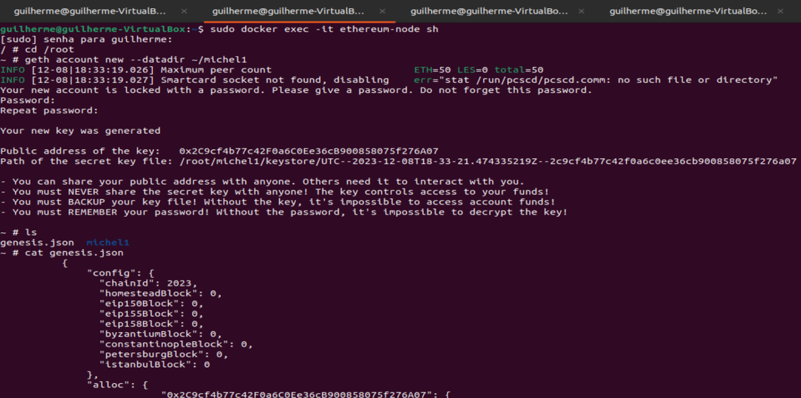
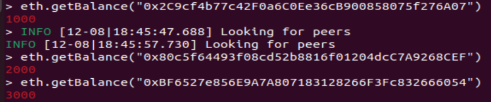
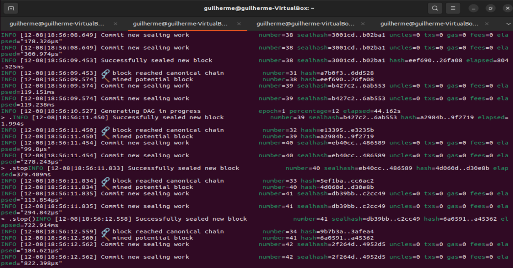
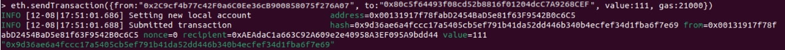
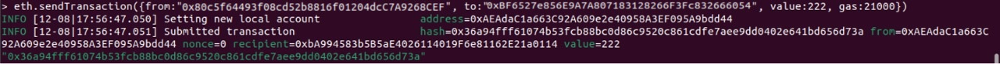
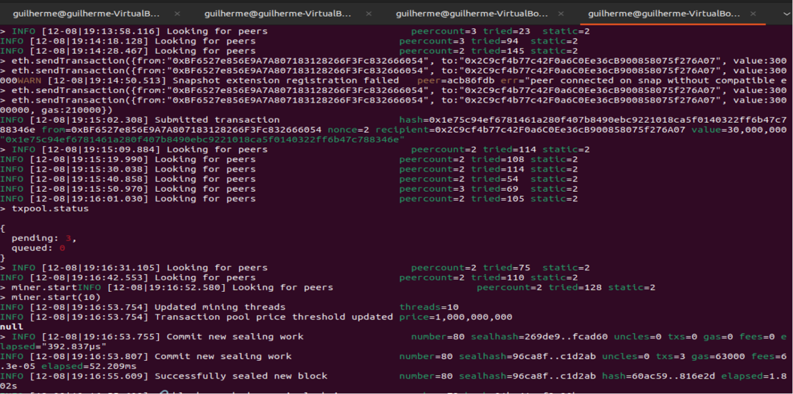
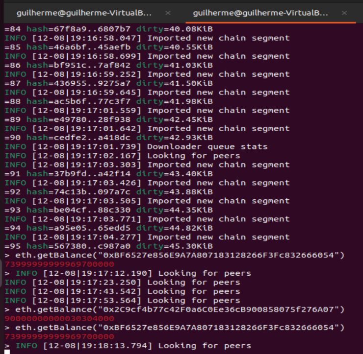
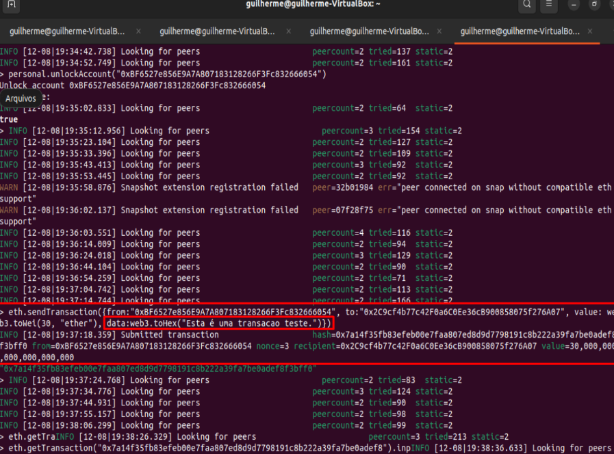
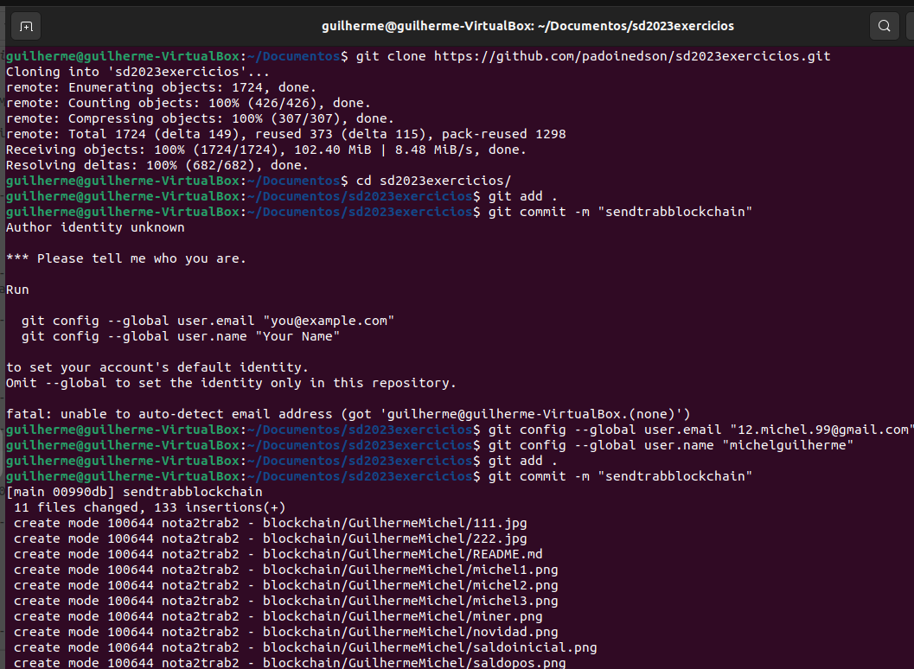
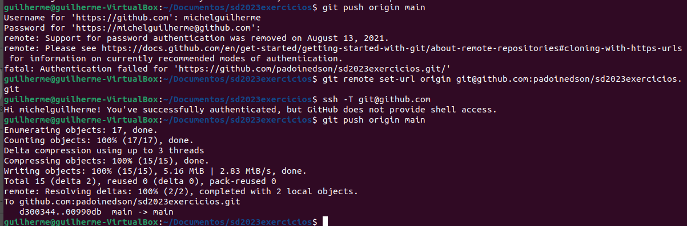

*Guilherme Peukert Michel*
### PASSOS PARA INSTALAÇÃO

- VM = Donwload virtual box, imagem linux, executar virtual box, criar máquina virtual, acessar terminal = sudo apt install docker

- Linux = acessar terminal = sudo apt install docker

### PASSOS PARA REALIZAÇÃO DAS ETAPAS

-  1-Criação da pasta:

	`$ mkdir ethereum`

- 2-Criar aquivo "genesis.json" e salvar dentro da pasta ethereum, dentro do arquivo conter passo a passo que professor disponibilizou em aula, porém referente a três contas com valores 1000, 2000 e 3000

- 3-Baixar imagem no terminal

	`$ sudo docker pull etherum/client-go:release-1.10`

- 4-Abrir mais 3 terminais para cada um sendo referente a uma conta, totalizando 4 terminais

- 5-No primeiro, para gerenciar o docker rodar

	`$ sudo docker run -d --name ethereum-node -v $HOME/ethereum:/root -p 8545:8545 -p 8544:8544 -p 30301:30301 -p 30302:30302 -p 30303:30303 -p 30304:30304 -it --entrypoint=/bin/sh ethereum/client-go:release-1.10`

- 6-Executar terminais das contas para verificar se esta pegando corretamente o arquivo e entrar dentro do container
	`$ sudo docker exec -it ethereum-node sh`
	`$ cd /root`
	`$cat genesis.json`

- 7-Agora parte para parte da criação das 3 contas, no segundo terminal (da conta 1)

	`$geth account new --datadir ~/michel1`

>nos demais terminais referente as contas executar o mesmo só mudando o final que seria o nome da conta, "../michel2" e "../michel3"

- 8-Com as contas criadas terá acesso as chaves públicas das contas, na qual vc deve guardar/salvar/decorar juntamente com a senha privada que é inserida na criação e essa chave pública deve ser inserida no arquivo genesis.json

- 9-Inicializar nós na rede 

	`$geth --datadir /root/michel1/ init genesis.json`
>esse comando realizar em todos terminais das contas alterando o nome da conta respectiva

- 10-Colocar os nós da rede para rodar em cada terminal destinado a uma das contas

	`$geth --datadir ~/michel1 --networkid 2023 --http --http.api 'txpool,eth,net,web3,personal,admin,miner' --http.corsdomain '*' --authrpc.port 8547 --allow-insecure-unlock console`
	`$geth --datadir ~/michel2 --networkid 2023 --http --http.api 'txpool,eth,net,web3,personal,admin,miner' --http.corsdomain '*' --authrpc.port 8546 --port 30302 --http.port 8544 --allow-insecure-unlock console`
	`$geth --datadir ~/michel3 --networkid 2023 --http --http.api 'txpool,eth,net,web3,personal,admin,miner' --http.corsdomain '*' --authrpc.port 8548 --port 30500 --http.port 30501 --allow-insecure-unlock console`

- 11-Verificar saldos iniciais das contas (1000,2000,3000)

	`$eth.getBalance("atualizar com a chave publica de cada conta")`

- 12-Para dar start e stop na mineração seria 

	`$miner.start(10)`
	`$miner.stop()`

- 13-Para verificar se deu tudo certo pode verificar saldos novamente utilizando o comanto do passo 11

- 14-Para realizar transação entre as contas deve autorizar elas, usando

	`$personal.unlockAccount("chave da conta")`

- 15-Autorizada a conta e inserida a senha pode realizar transação

	`$eth.sendTransaction({from:"chave", to:"chave", value:1111, gas:21000})`
	

- 16-Feito a transação ela vai ficar como pendente, pode verificar utilizando

	`$txpool.status`
	//estando pendente é só realizar um 
	
	`$miner.start(10)`
	`$miner.stop()`

- 17-Quando realizou o passo 16 pode verificar se esta pendente ainda "txpool.status", pode verificar saldos das contas como no passo 11 e averiguar se realmente aconteceu a transação

>Saldo não bate apenas com transação solicitada devido que foi realizado outras a fins de teste

### Novidade
- 18-Referente a novidade seria que no passo 15 o que é inserido no terminal muda, passando para 

	`$eth.sendTransaction({from:"chave", to:"chave", value:web3.toWei(300, "ether", data:web3.toHex("Descrição_da_transação)})`

>essa novidade referente ao que foi realizado em aula, seria para atribuir uma descrição para transação 

- Prints referente ao 
 -  git add .
 - git commit -m "sendtrabblockchain"
 - git push origin main
 
 

