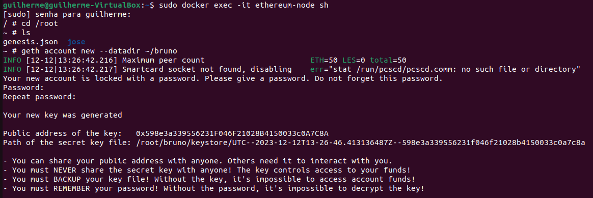
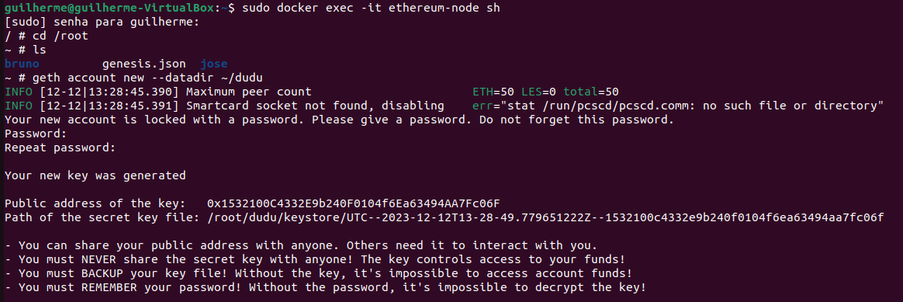
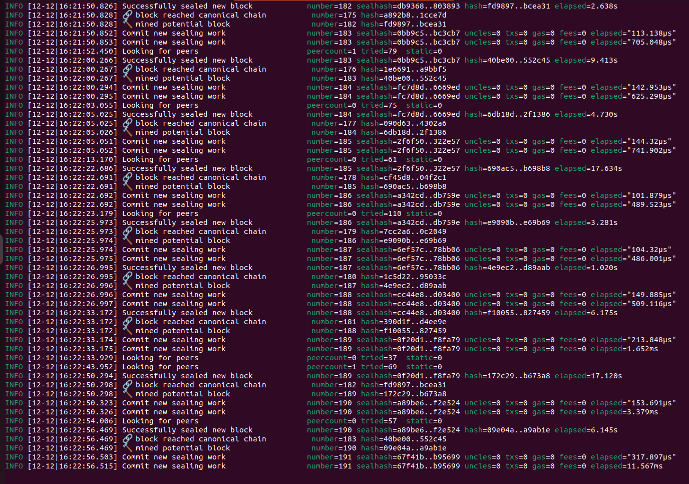
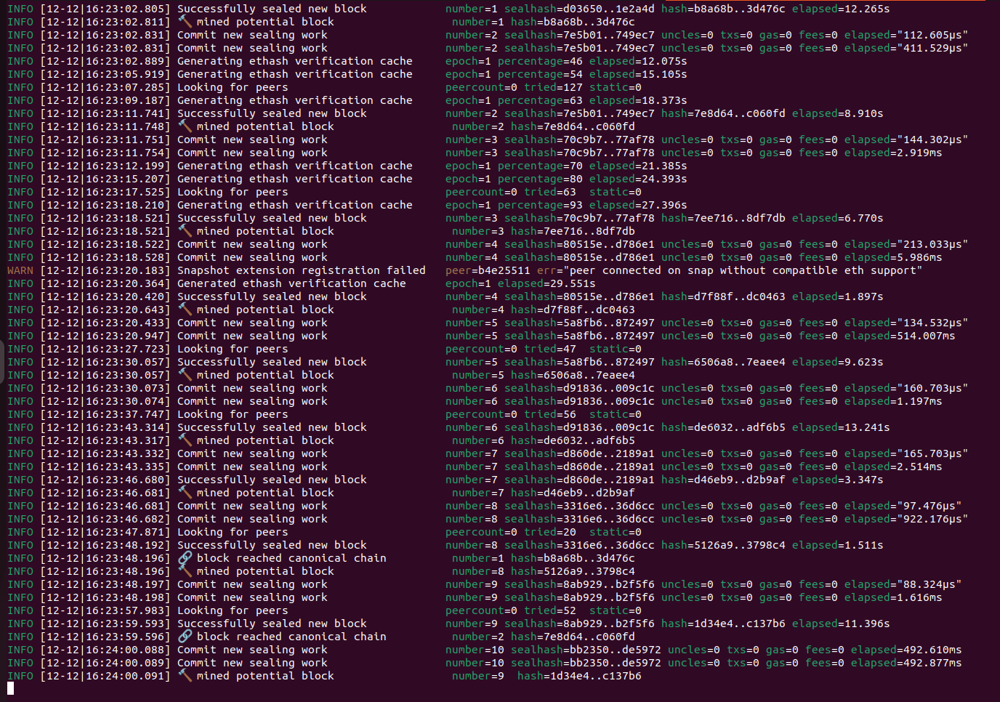
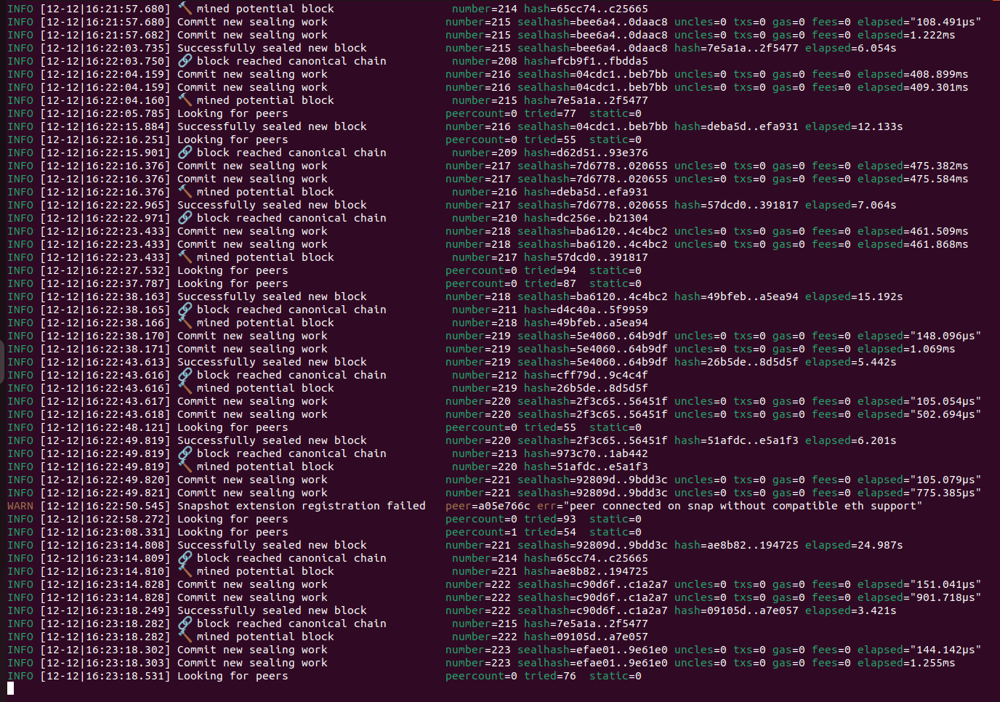

Blockchain Guilherme Bonfada

1 Primeiro atualizemos os pacotes com o comando: 

	$sudo apt update.

2 Para baixar a imagem, primeiro precisa baixar o docker com o comando: 

	$sudo apt install docker.

3 Baixando a imagem com o comando: 

	$sudo docker pull ethereum/client-go:release-1.10.

4 após isso, crie uma pasta chamada ethereum com o comando: 
	
	$mkdir ethereum

5 dentro dessa pasta, crie um arquivo com o comando abaixo, contendo o seguinte configuração, observa-se que esta sem nenhuma key, aonde vai ser cciadas elas para adicionar depois

	$nano genesis.json

{
   "config":{
      "chainId":2023,
      "homesteadBlock":0,
      "eip150Block":0,
      "eip155Block":0,
      "eip158Block":0,
      "byzantiumBlock":0,
      "constantinopleBlock":0,
      "petersburgBlock":0,
      "istanbulBlock":0
   },
   "alloc":{
      "":{
         "balance":"1000"
      },
      "":{
         "balance":"2000"
      },
      "":{
         "balance":"3000"
      }
   },
   "coinbase":"0x0000000000000000000000000000000000000000",
   "difficulty":"0x20000",
   "extraData":"",
   "gasLimit":"0x2fefd8",
   "nonce":"0x0000000000000111",
   "mixhash":"0x0000000000000000000000000000000000000000000000000000000000000000",
   "parentHash":"0x0000000000000000000000000000000000000000000000000000000000000000",
   "timestamp":"0x00"
}

6 para rodar o container usa o comando: 

	$sudo docker run -d --name ethereum-node -v $HOME/ethereum:/root -p 8545:8545 -p 8544:8544 -p 30301:30301 -p 30302:30302 -p 30303:30303 -p 30304:30304 -it --entrypoint=/bin/sh ethereum/client-go:release-1.10

7 Após rodar o container, foi startado novos 3 terminal no qual, neles foi usado o seguintes comandos para inicar o conteiner  

	$sudo docker exec -it ethereum-node sh 

8 Entrando neles, usa o comando 
	
	$cd /root para acessar a pasta root.

9 Depois, usa o comando 
	
	$cat genesis.json para puxar o arquivo para pasta root

10 Para criar as contas, usei o comando 

	$geth account new --datadir ~/(nome_da_conta), como podem observar nesses print abaixo, eu criei com os nomes jose, bruno e dudu, mas o usuario pode adicionar com qualquer nome desejado.

	
	
	

11 lembrando de anotar a senha e a chave publica, no qual deve ser colocada no arquivo genesis.json

12 Para iniciar os nós da rede usa o comando cada um no terminal aonde foi criado sua conta:

	$geth --datadir /root/jose/ init genesis.json
	$geth --datadir /root/bruno/ init genesis.json
	$geth --datadir /root/dudu/ init genesis.json
	
13 Em sequida, para colocar pra rodar os nós, usa o comando:
	no segundo terminar
	$geth --datadir ~/jose --networkid 2023 --http --http.api 'txpool,eth,net,web3,personal,admin,miner' --http.corsdomain '*' --authrpc.port 8547 --allow-insecure-unlock console
	no terceiro terminal
	$geth --datadir ~/bruno --networkid 2023 --http --http.api 'txpool,eth,net,web3,personal,admin,miner' --http.corsdomain '*' --authrpc.port 8546 --port 30302 --http.port 8544 --allow-insecure-unlock console
	no quarto terminal
	$geth --datadir ~/dudu --networkid 2023 --http --http.api 'txpool,eth,net,web3,personal,admin,miner' --http.corsdomain '*' --authrpc.port 8548 --port 30500 --http.port 30501 --allow-insecure-unlock console
	
14 Para ver se o saldo esta correto, use o comando, como exemplo do bruno:
	$eth.getBalance("0x598e3a339556231F046F21028B4150033c0A7C8A")
	
15 Segue as imagem para ver o funcionamento do codigo:

	
	
	

16 para comecar a minerar, usa o comando:

	$miner.start(10)

	
	
	
	
17 para parar de minerar, usa o comando:
	
	$miner.stop(10)

18 Caso queira confirmar se ta minerando, usa o comando:
	
	$eth.getBalance("chave_publica_da_conta")	 

19 Para fazer a parte de transação, antes e preciso liberar em todas as contas, usando o comando:

	$eth.sendTransaction({from:"chave_puclica_aonde_envia", to:"chave_publica_onde_reccebe", value:Valor, gas:21000})
	
	
	

20 apos isso, podemos conferir o seu sado final: 
	$eth.getBalance("chave_publica_da_conta")
	
	
	
	
	
	
NOVIDADE
	
21 Para a parte de novidade, vou utilizar 2 comando para melhor a visualização da mineração, pois a mineração pode estar ativa e o usuario não tem o conhecimento.

22 O comando abaixo ele vai mostrar se a mineração esta ativa (true: Ativada / false: Desativada)

	$ eth.mining
	
23 O comando abaixo, vai mostrar caso a mineração esta ativa, a taxa de hash da mineração

	$ eth.hashrate
	
	
	 

