### Aluno: Guilherme Eckhardt

### Passos para instalação - Para Virtual Box (Ubuntu)
### 1. Baixar Virtual Box.
```
https://www.virtualbox.org/
```
### 2. Baixar ISO Ubuntu.
```
https://ubuntu.com/download/desktop
```
### 3. Fazer a instalação do Ubuntu no Virtual Box.

### Passos para realização das etapas
### 1. Abra o terminal e crie uma pasta com o nome de ethereum:
```
mkdir ethereum
```
### 2. Criar um arquivo com o nome genesis.json dentro da pasta ethereum e adicionar os dados:
```
          {
              "config": {
                "chainId": 2023,
                "homesteadBlock": 0,
                "eip150Block": 0,
                "eip155Block": 0,
                "eip158Block": 0,
                "byzantiumBlock": 0,
                "constantinopleBlock": 0,
                "petersburgBlock": 0,
                "istanbulBlock": 0
              },
              "alloc": {
                          "0x90bA23C7A92C7d524E5B5cc9D6dA30D65Ba30944": {
                            "balance": "1000"
                          },
                          "0x90F8BE615B29B10B2E4B9BbF3ae17B970c86b955": {
                            "balance": "2000"
                          },
                          "0x90F8BE615B29B10B2E4B9BbF3ae17B970c86b955": {
                            "balance": "3000"
                          }
              },
              "coinbase": "0x0000000000000000000000000000000000000000",
              "difficulty": "0x20000",
              "extraData": "",
              "gasLimit": "0x2fefd8",
              "nonce": "0x0000000000000111",
              "mixhash": "0x0000000000000000000000000000000000000000000000000000000000000000",
              "parentHash": "0x0000000000000000000000000000000000000000000000000000000000000000",
              "timestamp": "0x00"
          }
```
### 3. Baixe a imagem:
```
sudo docker pull ethereum/client-go:release-1.10
```
### 4. Vamos rodar e inicializar um container:
```
sudo docker run -d --name ethereum-node -v $HOME/ethereum:/root -p 8545:8545 -p 8544:8544 -p 30301:30301 -p 30302:30302 -p 30303:30303 -p 30304:30304 -it --entrypoint=/bin/sh ethereum/client-go:release-1.10
sudo docker start ethereum-node
```
### 5. Agora temos que abrir mais 3 terminais, onde o primeiro será o principal e os outros serão clientes
### 6. Execute em cada um dos 3 terminais dos clientes os comandos:
```
sudo docker exec -it ethereum-node sh
cd /root
```
### 7. Agora execute nos 3 terminais os seguintes comandos para a criação clientes. Mude nome_cliente para o nome que quiser, mas deixe um diferente do outro
- ⚠️ Anote em um editor de texto a senha que foi colocada para cada cliente e a chave pública
```
geth account new --datadir ~/nome_cliente
```
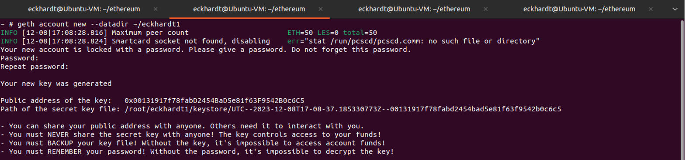
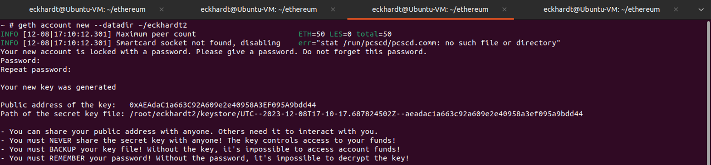
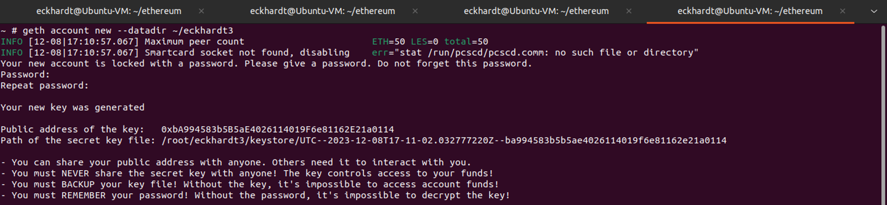
### 8. Atualize as chaves públicas do arquivo genesis.json com as chaves adquiridas anteriormente.
### 9. Inicialize os nós na rede em cada cliente:
```
geth --datadir /root/nome_cliente/ init genesis.json
```
### 10. Coloque os nós para rodar na rede:
```
geth --datadir ~/nome_cliente1 --networkid 2023 --http --http.api 'txpool,eth,net,web3,personal,admin,miner' --http.corsdomain '*' --authrpc.port 8547 --allow-insecure-unlock console
geth --datadir ~/nome_cliente2 --networkid 2023 --http --http.api 'txpool,eth,net,web3,personal,admin,miner' --http.corsdomain '*' --authrpc.port 8546 --port 30302 --http.port 8544 --allow-insecure-unlock console
geth --datadir ~/nome_cliente3 --networkid 2023 --http --http.api 'txpool,eth,net,web3,personal,admin,miner' --http.corsdomain '*' --authrpc.port 8548 --port 30500 --http.port 30501 --allow-insecure-unlock console
```
### 11. Vamos verificar o saldo das contas:
- As contas devem ter os respectivos saldos:
  - Primeiro cliente: 1000
  - Segundo cliente: 2000
  - Terceiro cliente: 3000
```
eth.getBalance("chave_publica")
```
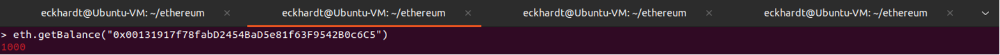
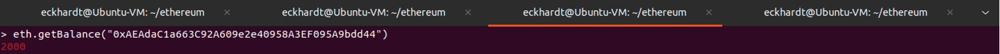
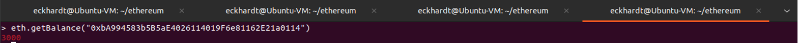
### 12. Vamos fazer uma mineração para conseguir mais saldo, use esses comandos para iniciar e parar a mineração:
```
miner.start(10)
miner.stop()
```
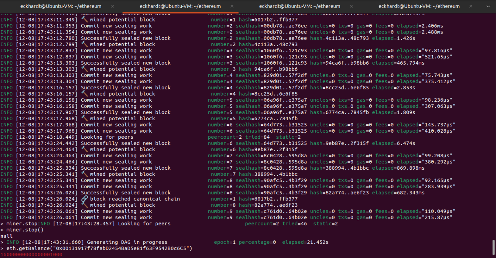
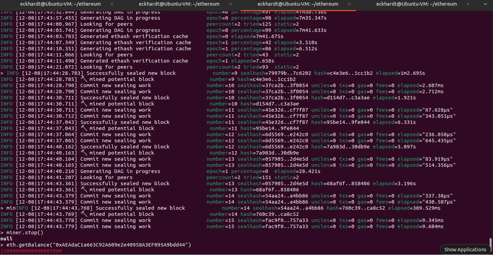
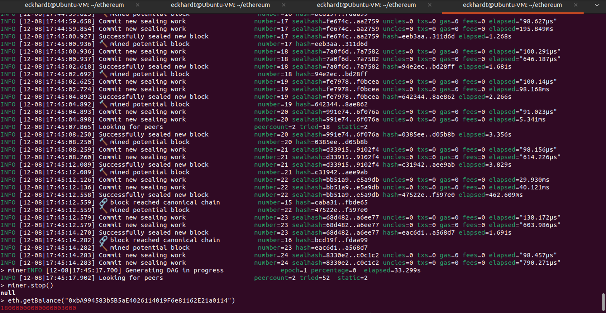
### 13. Vamos liberar as contas para uso para fazer transações:
```
personal.unlockAccount("chave_publica")
```
### 14. Faça uma transação de 111 do cliente1 para o cliente2
- Você deve iniciar uma mineração para conseguir fazer a transação e depois finalizar.
```
eth.sendTransaction({from:"chave_publica_cliente1", to:"chave_publica_cliente2", value:111, gas:21000})
```
- Você pode verificar o status da transação com o comando:
```
txpool.status
```
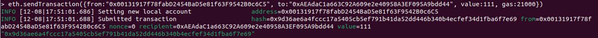
### 15. E faça uma transação de 222 do cliente2 para o cliente3
```
eth.sendTransaction({from:"chave_publica_cliente2", to:"chave_publica_cliente3", value:222, gas:21000})
txpool.status
```
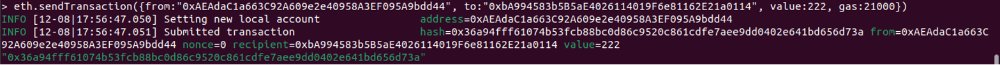
### 16. Verifique o saldo dos 3 clientes:
```
eth.getBalance("chave_publica")
```
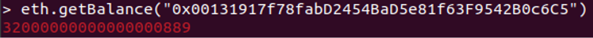
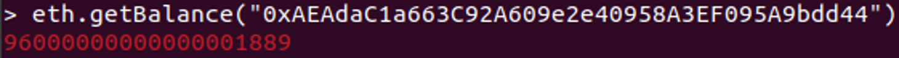
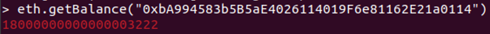

### Novidades
Como novidade trouxe alguns comandos que você pode usar que irão trazer mais informações sobre cada cliente:
- Fornece detalhes sobre o bloco mais recente na blockchain
```
eth.getBlock("latest")
```
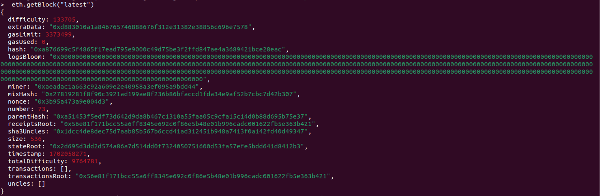
- Fornece informações da transação escolida
```
eth.getTransaction("hash_de_transacao")
```
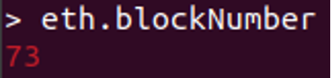
- Retorna o número do bloco atual
```
eth.blockNumber
```
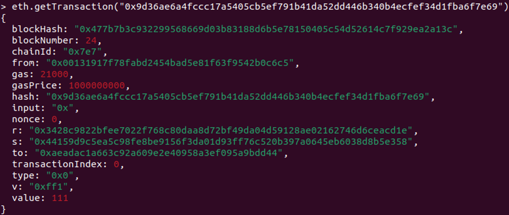

### GIT
- Imagens demonstrando que foi realizado o commit e push
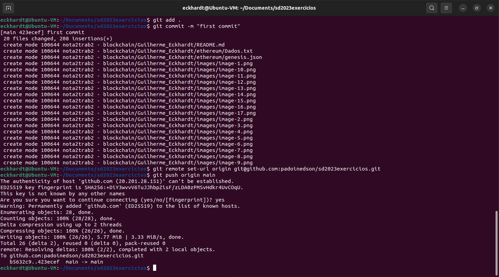