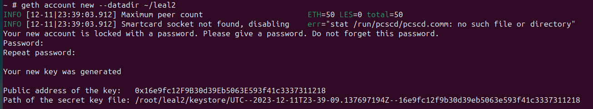
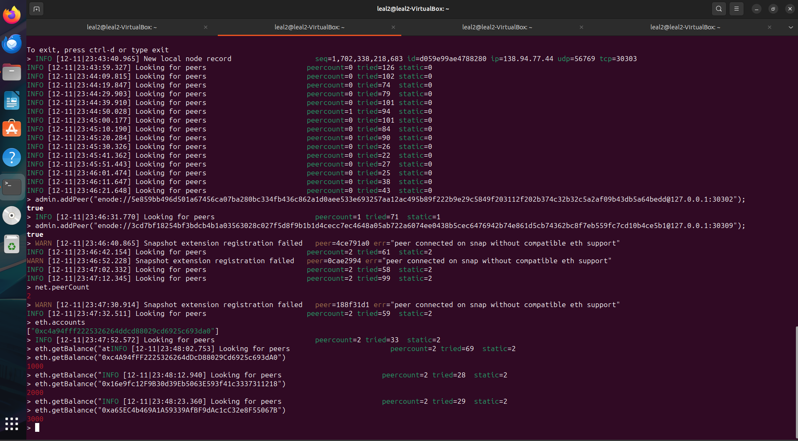
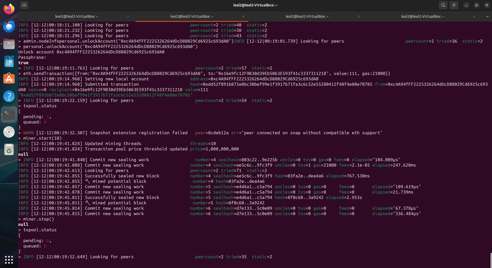
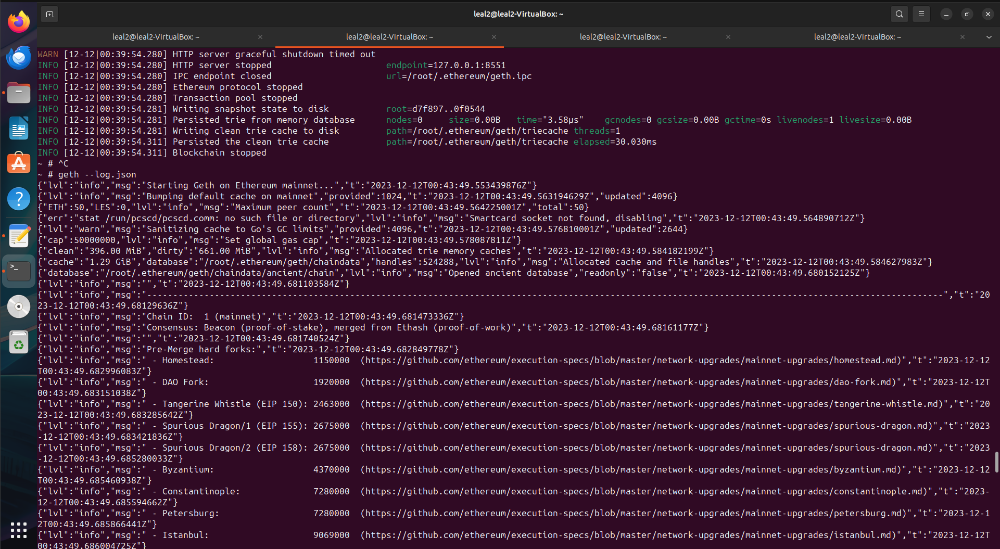
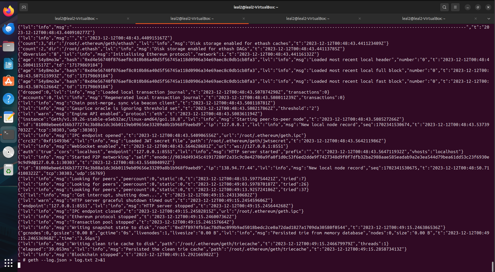
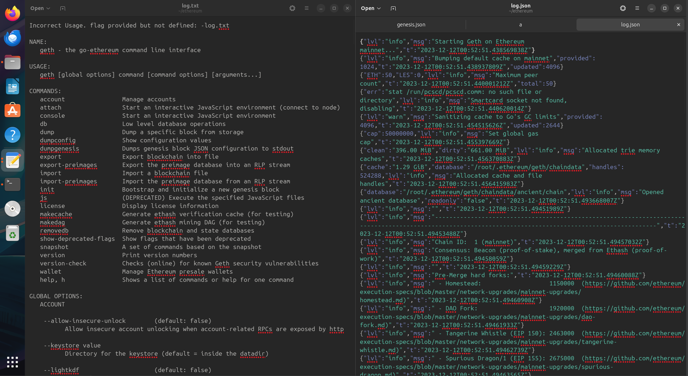

Guilherme Izidro Leal

## Passos Para Criação da Blockchain
Baixar docker.io caso não tenha no sistema

$ sudo apt install docker.io

Baixar o container utilizado durante esse trabalho

 
$ sudo docker pull ethereum/client-go:release-1.10

Criar uma pasta “ethereum”

$ mkdir ethereum

Dentro dela um arquivo genesis.json

$ cd ethereum
$ nano genesis.json

Nesse arquivo colocar o seguinte texto:

      {
        "config": {
          "chainId": 2023,
          "homesteadBlock": 0,
          "eip150Block": 0,
          "eip155Block": 0,
          "eip158Block": 0,
          "byzantiumBlock": 0,
          "constantinopleBlock": 0,
          "petersburgBlock": 0,
          "istanbulBlock": 0
        },
        "alloc": {
          "0xc4A94fFF2225326264dDcD88029Cd6925c693dA0": {
            "balance": "1000"
          },
          "0x16e9fc12F9B30d39Eb5063E593f41c3337311218": {
            "balance": "2000"
          },
          "0xa65EC4b469A1A59339AfBF9dAc1cC32e8F55067B": {
            "balance": "3000"
          }
        },
        "coinbase": "0x0000000000000000000000000000000000000000",
        "difficulty": "0x2000",
        "extraData": "",
        "gasLimit": "0x2fefd8",
        "nonce": "0x0000000000000111",
        "mixhash": "0x0000000000000000000000000000000000000000000000000000000000000000",
        "parentHash": "0x0000000000000000000000000000000000000000000000000000000000000000",
        "timestamp": "0x00"
      }

Rodar o container anteriormente instalado

$ sudo docker run -d --name ethereum-node -v $HOME/ethereum:/root -p 8545:8545 -p 8544:8544 -p 30301:30301 -p 30302:30302 -it --entrypoint=/bin/sh ethereum/client-go:release-1.10

Abrir mais 2 terminais
Rodar o seguinte comando nos 3 terminais

$ sudo docker exec -it ethereum-node sh

$ cd /root

## Criação das Contas
Criar uma conta com o seguinte comando em cada terminal (nesse exemplo foi dado o nome de lealN, mas no seu caso pode ser dado qualquer outro nome)

Terminal 1
$ geth account new --datadir ~/leal1

Terminal 2
$ geth account new --datadir ~/leal2

Terminal 3
$ geth account new --datadir ~/leal3
  

!!!IMPORTANTE!!!
Salvar informações:
“Public address of the key”
“Path of the secret key file”

Atualizar os dados no arquivo genesis.json com a “Public address of the key” de cada conta nos locais de “alloc”: 

"0xc4A94fFF2225326264dDcD88029Cd6925c693dA0": {
"balance": "1000"
  }

Após isso, rodar os seguintes comandos em cada terminal:

Terminal 1
$ geth --datadir /root/leal1/ init genesis.json

Terminal 2
$ geth --datadir /root/leal2/ init genesis.json

Terminal 3
$ geth --datadir /root/leal3/ init genesis.json

Terminal 1
$ geth --datadir ~/leal1 --networkid 2023 --http --http.api 'txpool,eth,net,web3,personal,admin,miner' --http.corsdomain '*' --authrpc.port 8547 --allow-insecure-unlock console

Terminal 2
$ geth --datadir ~/leal2 --networkid 2023 --http --http.api 'txpool,eth,net,web3,personal,admin,miner' --http.corsdomain '*' --authrpc.port 8546 --port 30302 --http.port 8544 --allow-insecure-unlock console

Terminal 3 (esse caso o comando é o mesmo do terminal 3 mas com outras portas, nesse exemplo foi usado o seguinte)
$ geth --datadir ~/leal3 --networkid 2023 --http --http.api 'txpool,eth,net,web3,personal,admin,miner' --http.corsdomain '*' --authrpc.port 8549 --port 30309 --http.port 8599 --allow-insecure-unlock console

Adicionar peers em nós, para isso os seguintes comandos deve ser usados em cada terminais:

Os comandos devem estar no formato: 

admin.addPeer("enode://3cd7bf18254bf3bdcb4b1a03563028c027f5d8f9b1b1d4cecc7ec4648a05ab722a6074ee0438b5cec6476942b74e861d5cb74362bc8f7eb559fc7cd10b4ce5b1@127.0.0.1:30309");

Terminal 1
$ admin.addPeer("<enode da conta número 2>");

$ admin.addPeer("<enode da conta número 3>");

Terminal 2
$ admin.addPeer("<enode da conta número 1>");

$ admin.addPeer("<enode da conta número 3>");

Terminal 3
$ geth --datadir /root/leal3/ init genesis.json

$ admin.addPeer("<enode da conta número 2>");

$ admin.addPeer("<enode da conta número 1>");

Conferir o saldo de cada conta:

$ eth.getBalance("0xa65EC4b469A1A59339AfBF9dAc1cC32e8F55067B")

O resultado deve ser o mesmo da imagem:

## Minerar Para Pegar Gas
Executar o comando para iniciar mineração

$ miner.start(10)

E para parar a mineração

$ miner.stop()

Conferir o saldo de cada conta novamente

$ eth.getBalance("0xa65EC4b469A1A59339AfBF9dAc1cC32e8F55067B")

## Fazer uma Transação
Realizar os comandos abaixos, mas substituindo as chaves públicas do exemplo pelas suas

eth.sendTransaction({from:"0xc4A94fFF2225326264dDcD88029Cd6925c693dA0", to:"0x16e9fc12F9B30d39Eb5063E593f41c3337311218", value:111, gas:21000})

eth.sendTransaction({from:"0x16e9fc12F9B30d39Eb5063E593f41c3337311218", to:"0xa65EC4b469A1A59339AfBF9dAc1cC32e8F55067B", value:222, gas:21000})

Com esses comandos foram transferidos 111 ETH da conta 1 para a 2 e 222 da 2 para a 3

Iniciar um mineração novamente para registrar as transações

$ miner.start(10)

$ miner.stop()

Conferir o saldo atual em todas as contas

$ eth.getBalance("0xc4A94fFF2225326264dDcD88029Cd6925c693dA0")

$ eth.getBalance("0x16e9fc12F9B30d39Eb5063E593f41c3337311218")

$ eth.getBalance("0xa65EC4b469A1A59339AfBF9dAc1cC32e8F55067B")

## Minhas novidades
Em meu exemplo eu fiz um arquivo de logs utilizando comandos Geth. Isso possibilita um histórico de ações detalhadas sobre o que acontece na blockchain

Para fazer isso, é necessário basta ir a pasta onde gostaria de salvar o arquivo de log, no caso do exemplo

$ cd /root

Após isso é necessário escolher o formato do arquivo que gostaria de ser salvo, como ele vem no formato .json neste exemplo foi escolhido salvar ele em um arquivo chamado log.json (posteriormente também salvei em um log.txt)

Se utilizar o comando

$  geth –log.json

Ao fazer isso percebe-se que o terminal começa a aparecer em um formato json
  

Se utilizarmos ao invés disso o comando

$ geth --log.json > log.json 2>&1

Veremos que o terminal para de mostrar qualquer output, e se abrirmos o arquivo que criamos, ele estará sendo atualizado em tempo real com o output que estaria no terminal normalmente
  

Dessa forma é possível manter um histórico organizado de qualquer ocorrência na sua conta ou blockchain