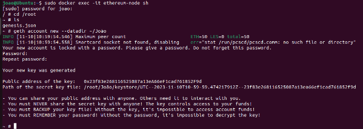
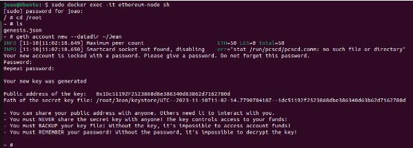
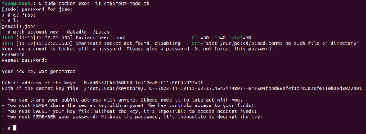
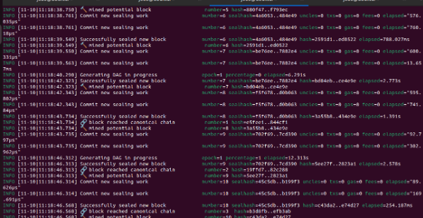
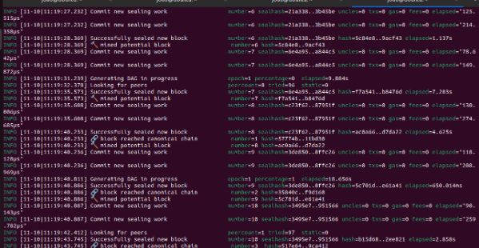

#### João Gabriel Foletto Schefer

### Passos para a instalação: (windows)

##### 1 Download do Virtual Box

##### 2 Download da imagem do Linux Ubuntu

##### 3 Executar o download do Virtual Box

##### 4 Criar a máquina virtual com a imagem do Ubuntu

##### 5 Acessar o terminal

##### 6 Rodar o seguinte comando para baixar a imagem 'ethereum/client-go':
	sudo docker pull ethereum/client-go:release-1.10
	
- Este comando é uma instrução do Docker, um sistema de gerenciamento de contêineres, que baixou a imagem especificada acima.
    
    
### Passos para a realização das etapas:

##### 1 Foi criada uma pasta com o nome de ethereum, com o comando 'mkdir ethereum'

##### 2 Dentro desta pasta foi salvo um arquivo chamado genesis.json. Nest arquivo configurei 3 contas, a primeira com o valor de 1000, a segunda 2000 e a terceira 3000.

##### 3 Baixei a imagem 'ethereum/client-go'

##### 4 Rodei o container com o seguinte comando:
	sudo docker run -d --name ethereum-node -v $HOME/ethereum:/root -p 8545:8545 -p 8544:8544 -p 30301:30301 -p 30302:30302 -p 30303:30303 -p 30304:30304 -it -- 	entrypoint=/bin/sh ethereum/client-go:release-1.10
	
- Foi adicionado mais algumas portas, pois foi adicionada mais uma conta.

##### 5 O próximo passo foi abrir outros terminais. No segundo, no terceiro e no quarto rodamos os seguintes comandos:
	sudo docker exec -it ethereum-node sh
	
##### esse comando executou um shell interativo dentro do container. O parâmetro '-it' indica que a execução deve ser interativa e conectar o terminal do host ao terminal dentro do container.
    cd /root
	
##### esse comando mudou o diretório de trabalho para /root
	cat genesis.json
	
- verificar se está tudo correto.

##### 6 Para criar as contas usei o seguinte comando:
	geth account new --datadir ~/(nome_da_conta)
	
- Em (nome_da_conta), é preciso trocar pelo nome que tu quer dar a conta, no meu caso criei 3 contas com o nome de João, Jean e Lucas. Tem que fazer isso com todas as contas, em seus respectivos terminais, um para cada conta.

##### 7 Depois de criar as contas, é preciso anotar a senha da conta e a chave pública, pois serão usadas no futuro.

##### 8 É preciso pegar essas chaves publicas e atiualizar no arquivo genesis.json

##### 9 Em seguida, é necessário dar o seguinte comando:
	geth --datadir /root/nome_da_conta/ init genesis.json == trocar o nome_da_conta pelo nome da sua conta
- Esse comando vai iniciar os nós na rede. Tem que fazer isso com todas as contas, em seus respectivos terminais, um para cada conta.
    
    
##### 10 Nesse passo, foi colocado os nós da rede para rodar:
##### No segundo terminal rodamos o comando
    geth --datadir ~/João --networkid 2023 --http --http.api 'txpool,eth,net,web3,personal,admin,miner' --http.corsdomain '*' --authrpc.port 8547 --allow-insecure-unlock console
    
    
##### No terceiro terminal
    geth --datadir ~/Jean --networkid 2023 --http --http.api 'txpool,eth,net,web3,personal,admin,miner' --http.corsdomain '*' --authrpc.port 8546 --port 30302 --http.port 8544 --allow-insecure-unlock console
    
    
##### No quarto terminal 
    geth --datadir ~/Lucas --networkid 2023 --http --http.api 'txpool,eth,net,web3,personal,admin,miner' --http.corsdomain '*' --authrpc.port 8548 --port 30500 --http.port 30501 --allow-insecure-unlock console
	
	
##### 11 = É importante anotar o seu enode, exemplo => João: 
	self=enode://33a051ac754ff2b09b887081e7018c39a45bdb19df326113df0e961e2c996337c7f174ca7d345c41e8daa11a6451b5be99fe4a38d98c191ed97dcfd4488ece2d@127.0.0.1:30303
	
	
##### 12 = Agora, o seguinte comando verifica o saldo em cada conta, como exemplo usar a conta João:
	eth.getBalance("0x23f83e268116525087a13eA66eF1cad761852F9d") 
- É preciso alterar o que está entre parenteses pela key da conta. Se fizer isso com as três contas, vai ver que possui 1000, 2000 e 3000 nas contas.

	
	

##### 13 = Para começar a minerar
    miner.start(10)

- 10 é o número de threads

##### 14 = Para parar de minerar
    miner.stop(10)
    

##### 15 = Pode ser verificado o saldo agora também, seguindo o passo 12

##### 16 = Na parte de transação, precisei liberar a conta antes, com o seguinte comando (fazer isso com todas as contas):
	personal.unlockAccount("0x23f83e268116525087a13eA66eF1cad761852F9d")
	
	
##### 17 = Para enviar uma transação, usei o seguinte comando:
	eth.sendTransaction({from:"0x23f83e268116525087a13eA66eF1cad761852F9d", to:"0x1Dc51192F2523868dBe386340d63B62d7162780d", value:111, gas:21000})
	
- Neste ccomando, precisei colocar a key da conta que quero tirar o dinheiro e a key da conta que quero enviar o dinheiro, especificando o valor em value.

##### 18 = É possível verificar o poool de transações com o seguinte comando:
	txpool.status

##### 19 = É preciso minerar novamente para confirmar a transação com o "miner.start(10)"

##### 20 = Depois "miner.stop()" para encerrar a mineração

##### 21 = Agora eu conferi novamente o saldo das contas, seguindo o passo 12.

	

#### No Ethereum, a blockchain é composta por blocos, e cada bloco contém uma lista de transações. Você pode verificar informações sobre os blocos, como o número de blocos mais recente usando comando "eth.blockNumber". Depois de digitar esse comando, vai ser retornado o número do bloco mais recente na blockchain Ethereum. Esse número representa a posiçãoi do bloco na cadeia e é incrementado sempre que um novo bloco é adicionado a blockchain. Isso é útil para acompanhar o progresso da blockchain e para verificar o estado atual da rede. Você pode usar informações de bloco como essa para rastrear transações, contratos inteligentes, ...

##### 22 = "eth.blockNUmber" e será mostrada o numero do bloco (olhar os prints).

