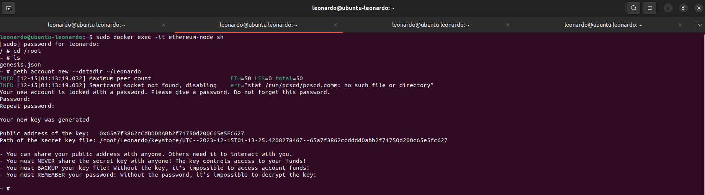
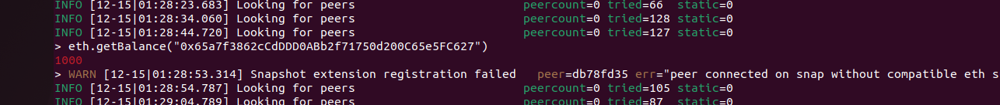

## Passo a Passo

##### Faça o download do Virtual Box (https://www.virtualbox.org/)

##### Baixe a imagem do Ubuntu (https://ubuntu.com/download/desktop)

##### Crie e configure (placa em modo Bridge) a máquina virtual com a imagem do Ubuntu

##### Acesse o terminal e comece

1. Atualize e faça o upgrade do sistema:
    ```bash
    sudo apt update
    sudo apt upgrade
    ```

2. Crie um diretório chamado 'ethereum' e entre na pasta:
    ```bash
    mkdir ethereum
    cd ethereum
    ```

3. Crie o arquivo `genesis.json`:
    ```bash
    nano genesis.json
    ```

    Cole, salve o seguinte conteúdo e pode sair da pasta:
    ```json
    {
        "config": {
            "chainId": 2023,
            "homesteadBlock": 0,
            "eip150Block": 0,
            "eip155Block": 0,
            "eip158Block": 0,
            "byzantiumBlock": 0,
            "constantinopleBlock": 0,
            "petersburgBlock": 0,
            "istanbulBlock": 0
        },
        "alloc": {
            "0x90bA23C7A92C7d524E5B5cc9D6dA30D65Ba30944": {
                "balance": "5000"
            },
            "0x90F8BE615B29B10B2E4B9BbF3ae17B970c86b955": {
                "balance": "6000"
            }
        },
        "coinbase": "0x0000000000000000000000000000000000000000",
        "difficulty": "0x20000",
        "extraData": "",
        "gasLimit": "0x2fefd8",
        "nonce": "0x0000000000000111",
        "mixhash": "0x0000000000000000000000000000000000000000000000000000000000000000",
        "parentHash": "0x0000000000000000000000000000000000000000000000000000000000000000",
        "timestamp": "0x00"
    }
    ```
    
    ```bash
    cd ..
    ```

4. Instale o Docker:
    ```bash
    sudo apt install docker
    sudo apt install docker.io
    ```

5. Baixe a imagem 'ethereum/client-go':
    ```bash
    sudo docker pull ethereum/client-go:release-1.10
    ```

6. Execute o container:
    ```bash
    sudo docker run -d --name ethereum-node -v $HOME/ethereum:/root -p 8545:8545 -p 8544:8544 -p 30301:30301 -p 30310:30310 -p 30320:30320 -p 30330:30330 -it --entrypoint=/bin/sh ethereum/client-go:release-1.10
    ```

7. Abra outros 3 terminais, acesse o container e de um ls para verificar se o arquivo `genesis.json` está presente:
    ```bash
    sudo docker exec -it ethereum-node sh
    cd /root
    ls
    ```

8. Crie contas usando o comando abaixo para cada conta:
    ```bash
    geth account new --datadir ~/nome-da-conta
    ```
    - Substitua 'nome-da-conta' pelo nome desejado para a conta. No meu caso, criei 3 contas, uma com o nome Leonardo, outra Leozinho e a ultima Leozao
    
    
    
    


9. Copie a chave pública e atualize o arquivo `genesis.json`.

    ```json
    {
        "config": {
            "chainId": 2023,
            "homesteadBlock": 0,
            "eip150Block": 0,
            "eip155Block": 0,
            "eip158Block": 0,
            "byzantiumBlock": 0,
            "constantinopleBlock": 0,
            "petersburgBlock": 0,
            "istanbulBlock": 0
        },
        "alloc": {
            "0x65a7f3862cCdDDD0ABb2f71750d200C65e5FC627": {
                "balance": "1000"
            },
            "0x4c4CC7cD985915c644E0242A3cF79e1B7C5fE6B5": {
                "balance": "2000"
            },
            "0x2A44D4a9061286ff933BEe276D6BE88C4f294f83": {
                "balance": "3000"
            }
        },
        "coinbase": "0x0000000000000000000000000000000000000000",
        "difficulty": "0x20000",
        "extraData": "",
        "gasLimit": "0x2fefd8",
        "nonce": "0x0000000000000111",
        "mixhash": "0x0000000000000000000000000000000000000000000000000000000000000000",
        "parentHash": "0x0000000000000000000000000000000000000000000000000000000000000000",
        "timestamp": "0x00"
    }
    ```

10. Inicie os nós na rede para cada conta:
    ```bash
    geth --datadir /root/nome-da-conta/ init genesis.json
    ```

11. Nos terminais respectivos para cada conta, execute:
    ```bash
    geth --datadir ~/Leonardo --networkid 2023 --http --http.api 'txpool,eth,net,web3,personal,admin,miner' --http.corsdomain '*' --authrpc.port 8547 --allow-insecure-unlock console
    ```

    ```bash
    geth --datadir ~/Leozinho --networkid 2023 --http --http.api 'txpool,eth,net,web3,personal,admin,miner' --http.corsdomain '*' --authrpc.port 8546 --port 30302 --http.port 8544 --allow-insecure-unlock console
    ```

    ```bash
    geth --datadir ~/Leozao --networkid 2023 --http --http.api 'txpool,eth,net,web3,personal,admin,miner' --http.corsdomain '*' --authrpc.port 8548 --port 30500 --http.port 30501 --allow-insecure-unlock console
    ```

12. Em cada terminal, use a chave respectiva para verificar o saldo da conta:
    ```bash
    eth.getBalance("0x65a7f3862cCdDDD0ABb2f71750d200C65e5FC627")
    eth.getBalance("0x4c4CC7cD985915c644E0242A3cF79e1B7C5fE6B5")
    eth.getBalance("0x2A44D4a9061286ff933BEe276D6BE88C4f294f83")
    ```
    
    
    

13. Inicie a mineração:
    ```bash
    miner.start(10)
    ```
    
    
    

14. Pare a mineração:
    ```bash
    miner.stop()
    ```

15. Desbloqueie as contas para transações colando o comando abaixo e digitando a senha escolhida pra conta:
    ```bash
    personal.unlockAccount("0x65a7f3862cCdDDD0ABb2f71750d200C65e5FC627")
    personal.unlockAccount("0x4c4CC7cD985915c644E0242A3cF79e1B7C5fE6B5")
    personal.unlockAccount("0x2A44D4a9061286ff933BEe276D6BE88C4f294f83")
    ```

16. Envie transações entre contas:
    - Primeira conta para a segunda:
    ```bash
    eth.sendTransaction({from:"0x65a7f3862cCdDDD0ABb2f71750d200C65e5FC627", to:"0x4c4CC7cD985915c644E0242A3cF79e1B7C5fE6B5", value:111, gas:21000})
    ```
    

    - Segunda conta para a terceira:
    ```bash
    eth.sendTransaction({from:"0x4c4CC7cD985915c644E0242A3cF79e1B7C5fE6B5", to:"0x2A44D4a9061286ff933BEe276D6BE88C4f294f83", value:222, gas:21000})
    ```
    

17. Verifique o status do pool de transações:
    ```bash
    txpool.status
    ```

18. Reinicie a mineração para confirmar transações:
    ```bash
    miner.start(10)
    ```

19. Pare a mineração para efetuar as transações:
    ```bash
    miner.stop()
    ```

20. Verifique o saldo novamente para cada conta:
    ```bash
    eth.getBalance("0x65a7f3862cCdDDD0ABb2f71750d200C65e5FC627")
    eth.getBalance("0x4c4CC7cD985915c644E0242A3cF79e1B7C5fE6B5")
    eth.getBalance("0x2A44D4a9061286ff933BEe276D6BE88C4f294f83")
    ```
    
    
    

## Novidade

- `eth.pendingTransactions`: Este comando exibe as transações pendentes na mempool da rede, útil para verificar quais transações aguardam confirmação pelos mineradores.
    ```bash
    eth.pendingTransactions
    ```

    
    
### GIT

    
    
    

