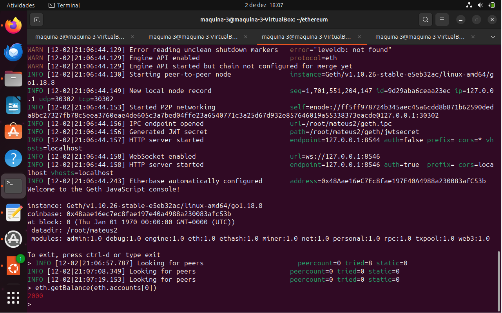

Nome do aluno: Mateus E. Chitolina
## Instalação
Primeiramente foi necessário instalar o docker para realizar os testes. Os seguintes comandos foram utilizados:

`sudo apt install docker`

`sudo apt install docker.io`

`sudo apt install docker-compose`

Depois de ter o docker instalado é necessário realizar o download da imagem que desejamos utilizar. No nosso caso é client-go:release-1.10. então é utilizado o comando:

`sudo docker pull ethereum/client-go:release-1.10`

## Etapas realizadas
Apos realizar o download da imagem é necessário criar um diretório que vai ser comparilhado com o container que vamos utilizar.

Para criar o diretório que vamos utilizar basta digitar:

`mkdir ethereum`

Dentro da pasta ethereum vamos criar o arquivo genesis.json para armazenar as primeiras configurações dos nós. Dentro desse arquivo informamos o seguinte:

      	{
          	"config": {
            	"chainId": 2023,
            	"homesteadBlock": 0,
            	"eip150Block": 0,
            	"eip155Block": 0,
            	"eip158Block": 0,
            	"byzantiumBlock": 0,
            	"constantinopleBlock": 0,
            	"petersburgBlock": 0,
            	"istanbulBlock": 0
          	},
          	"alloc": {
          	},
          	"coinbase": "0x0000000000000000000000000000000000000000",
          	"difficulty": "0x20000",
          	"extraData": "",
          	"gasLimit": "0x2fefd8",
          	"nonce": "0x0000000000000111",
          	"mixhash": "0x0000000000000000000000000000000000000000000000000000000000000000",
          	"parentHash": "0x0000000000000000000000000000000000000000000000000000000000000000",
          	"timestamp": "0x00"
      	}

Apos realizar as devidas configurações subimos o doquer da imagem baixada utilizando o seguinte código:

`sudo docker run -d --name ethereum-node -v $HOME/ethereum:/root -p 8545:8545 -p 8544:8544 -p 30301:30301 -p 30302:30302 -it --entrypoint=/bin/sh ethereum/client-go:release-1.10`

Apos subir o container abrimos três novas abas do nosso terminal para realizarmos os testes dentro do container que subimos. É importante ressaltar que foi deixado a priemira aba do terminal para exclusivamente subir o container e relizar manutenções na pasta ethereum caso seja necessário.

Nas novas abas entremos no container utiliznado o comando `sudo docker exec -it ethereum-node sh`. 
> Para evitamos problemas futuros é bom nos movermos para a pasta `~` assim que entrar no container.

Apos entrar no container é a hora de criamos as contas para realizar a interação. Assim utilizamos os seguintes comandos:
> No segundo terminal.

`geth account new --datadir ~/mateus1`

> No terceiro terminal.

`geth account new --datadir ~/mateus2`

> No quarto terminal.

`geth account new --datadir ~/mateus3`

A seguir é temos as imagens registradas no momento da criação das contas:

É possível ver que as chaves públicas foram criadas para as respectivas contas:

mateus1 - 0xe70e4EA3C1ec10D7Ca7494Db4e187f8Dfdb85D71

mateus2 - 0x48Aae16eC7Ec8fae197E40A4988a230083afC53b

mateus3 - 0x3032f4265804e498aD07D0D9882965374e1aE5cd

Com as chaves públicas que vão ser utilizadas em mão é necessário modificar o arquivo genesis.json no primeiro terminal para adicionar as mesmas. Pra isso utilizamos o comando `nano genesis.json` e alteramos a linha "alloc" com o objetivo de adicionar as chaves públicas e adicionar o saldo inicial de 1000, 2000 e 3000 ficando assim:

      	{
          	"config": {
            	"chainId": 2023,
            	"homesteadBlock": 0,
            	"eip150Block": 0,
            	"eip155Block": 0,
            	"eip158Block": 0,
            	"byzantiumBlock": 0,
            	"constantinopleBlock": 0,
            	"petersburgBlock": 0,
            	"istanbulBlock": 0
          	},
          	"alloc": {
                      	"0xe70e4EA3C1ec10D7Ca7494Db4e187f8Dfdb85D71": {
                        	"balance": "1000"
                      	},
                      	"0x48Aae16eC7Ec8fae197E40A4988a230083afC53b": {
                        	"balance": "2000"
                      	},
   		                  "0x3032f4265804e498aD07D0D9882965374e1aE5cd": {
                        	"balance": "3000"
                      	}
          	},
          	"coinbase": "0x0000000000000000000000000000000000000000",
          	"difficulty": "0x20000",
          	"extraData": "",
          	"gasLimit": "0x2fefd8",
          	"nonce": "0x0000000000000111",
          	"mixhash": "0x0000000000000000000000000000000000000000000000000000000000000000",
          	"parentHash": "0x0000000000000000000000000000000000000000000000000000000000000000",
          	"timestamp": "0x00"
      	}

Apos realizar a alteração das chaves no arquivos iniciamos o nó na rede em cada terminal utilizando os comandos:

> No segundo terminal.

`geth --datadir /root/mateus1/ init genesis.json`

> No terceiro terminal.

`geth --datadir /root/mateus2/ init genesis.json`

> No quarto terminal.

`geth --datadir /root/mateus3/ init genesis.json`

Antes de colocar os nós na rede para rodar realizei uma pequena melhoria para facilitar nas transações que vão ser feitas futuramente. A melhoria em questão seria um script de minha autoria que vai ser injetado no terminal de intereção com as contas ao colocar os nós para rodar na rede. Primeiramente criei um novo arquivo dentro da pasta `ethereum` do primeiro terminal chamado `scriptPersonalizado.js` que vai receber o script criado, o script em questão é:

    var chavesConta = {mateus1:"0xe70e4EA3C1ec10D7Ca7494Db4e187f8Dfdb85D71", mateus2:"0x48Aae16eC7Ec8fae197E40A4988a230083afC53b", mateus3:"0x3032f4265804e498aD07D0D9882965374e1aE5cd"};
    
    var tranferirMoeda = function(conta1, conta2, qtde, valorGas, senhaConta1) {
        if (!valorGas) {
            valorGas = 21000;
        }

        if (Object.keys(chavesConta).includes(conta1) && Object.keys(chavesConta).includes(conta2) && qtde) {
            if (!senhaConta1) {
                personal.unlockAccount(chavesConta[conta1]);
            }
            else
            {
                personal.unlockAccount(chavesConta[conta1], senhaConta1);
            }
    
            eth.sendTransaction({from:chavesConta[conta1], to:chavesConta[conta2], value:qtde, gas:valorGas})
        }
        else if (!Object.keys(chavesConta).includes(conta1) || !Object.keys(chavesConta).includes(conta2))
        {
            return "Uma das contas infomadas nao foram encontradas";
        }
        else
        {
            return "Necessario ser uma quantidade valida para tranferir"
        }
    }

Ao finalizar o script e salvar o arquivo fica assim:

O script em questão facilita a transação entre as contas, foi criado uma função chamada `tranferirMoeda` como alternativa ao tradicional eth.sendTransaction(). A nova função vai tando desbloquer a conta quanto realizar a transação, assim não sendo necessário desbloquear a conta antes de realizar a transação. A função em questão foi adaptada para receber apenas as contas que foram criadas anteriorimente (mateus1, mateus2 e mateus3), para acrescentar mais contas é necessário alterar a variável `chavesConta` que armazena o json das contas com as suas respectivas chaves.

> Parâmetros:
> 
> conta1 - informa o nome da conta que deseja ser retirado o valor (Ex: "mateus1");
> 
> conta2 - informa o nome da conta que via ser depositado o valor (Ex: "mateus2");
> 
> qtde -  valor que vai ser tranferido;
> 
> valorGas - valor do gas que deseja (opcional, padrão: 21000);
> 
> senhaConta1 - senha da que vai ser retido o valor (opcional, caso não seja informado e for necessário ele vai pedir a senha).

Apos configurar o script coloquei os nós para rodar na rede com os seguintes comandos 

> No segundo terminal.

`geth --datadir ~/mateus1 --networkid 2023 --http --http.api 'txpool,eth,net,web3,personal,admin,miner' --http.corsdomain '*' --authrpc.port 8547 --allow-insecure-unlock --preload scriptPersonalizado.js console`

> No terceiro terminal.

`geth --datadir ~/mateus2 --networkid 2023 --http --http.api 'txpool,eth,net,web3,personal,admin,miner' --http.corsdomain '*' --authrpc.port 8546 --port 30302 --http.port 8544 --allow-insecure-unlock --preload scriptPersonalizado.js console`

> No quarto terminal.

`geth --datadir ~/mateus3 --networkid 2023 --http --http.api 'txpool,eth,net,web3,personal,admin,miner' --http.corsdomain '*' --authrpc.port 8542 --port 30301 --http.port 8543 --allow-insecure-unlock --preload scriptPersonalizado.js console`

ATENÇÃO

Para que o script que foi criado seja inserido no console ao executar o comando a cima é importante utilizar a flag `--preload` e expecificar o script que queira inserir. No meu caso foi o `scriptPersonalizado.js` então `--preload scriptPersonalizado.js`. Exemplo:

Apos botar os nós para rodas visualizo o saldo da minha conta utilizando o comando:

`eth.getBalance(eth.accounts[0])`

> eth.accounts[0] retorna uma lista de chaves públicas que foram criadas no diretório em que foi mencionado na flag `--datadir` ao subir o nó para a rede e como possui apenas uma conta vai retornar o valor da conta que foi criada anteriormente.

Imagens dos saldos iniciais de cadas conta:

Apos verficar o saldo adicionei os peers necessário para reconhecer as demais contas, foi executado os seguintes comandos:

> No segundo terminal.

`admin.addPeer("enode://86c2907e0646f527c268b9a229df5bc10e7b7fc9e8ffdf94e75af8f9c4411383f1e5194e49ed3e94fc7a3e0c432fc5d41f628f2da058e1d71d2ec68166c4bc70@127.0.0.1:30301")`

`admin.addPeer("enode://ff5ff978724b345aec45a6cdd8b871b62590deda8bc27327fb78c5eea3760eae4de605c3a7bed04ffe23a6540771c3a25d67d932e857646019a55338373eacde@127.0.0.1:30302")`

> No terceiro terminal.

`admin.addPeer("enode://86c2907e0646f527c268b9a229df5bc10e7b7fc9e8ffdf94e75af8f9c4411383f1e5194e49ed3e94fc7a3e0c432fc5d41f628f2da058e1d71d2ec68166c4bc70@127.0.0.1:30301")`

Assim todas as contas vão receonhecer uma a outra. Caso seja necessário utilize o comando `net.peerCount` para vizualizar quantas contas foram reconhecidas, no nosso caso é necessário que esteja com 2 em todos os terminais.

Para realizar a mineração em casa usuário basta utilizar o comando `miner.start([número de threads que deseja])`, no meu caso utilizei `miner.start(1)`.

Imagens das contas minerando:

Para realizarmos as transações vou utilizar a função que foi criada e inejtada ao rodar o nó na rede. Para isso basta digitar o seguinte comando:

> No segundo terminal

`tranferirMoeda("mateus1", "mateus2", 111)`

> Vai ser tranferido uma quantia de 111 da conta mateus1 para mateus2

> No terceiro terminal

`tranferirMoeda("mateus2", "mateus3", 222)`

> Vai ser tranferido uma quantia de 222 da conta mateus2 para mateus3

> Importante lembrar que está sendo informado apenas o nome da conta por conta da mesma já estar registrada na variável `chavesConta`

Apos executar cada comando de tranferencia é possivel ver que a tranferencia está pendente com o comando `txpool.status`, caso esteja pendente é necessário minerar para realizar a tranferencia, então é utilizado o comando `miner.start(1)` para minerar e realizar a tranferencia, apos utilizo o comando `txpool.status` novamente para verificar se não possuo mais nenhuma pendência.

Imagens das tranferencias:

Por fim é feito a consulta do saldo final de cada conta apos realizar as transações utilizando novamente o comando `eth.getBalance(eth.accounts[0])`. 

Imagens dos saldos finais das contas:

## Novidade em relação ao exemplo da aula

Para diferenciar, realizei a criação de um script que foi injetado juntamente ao console interativo quando for colocado os nós na rede, novo script possui uma nova função que foi explicada anteriromente para polpar tempo e esforço ao realizar uma transação. É possível fazer muitas coisas com isso, esse foi apenas um pequeno exemplo do que pode ser feito.

## Imagens do envio para o git:

