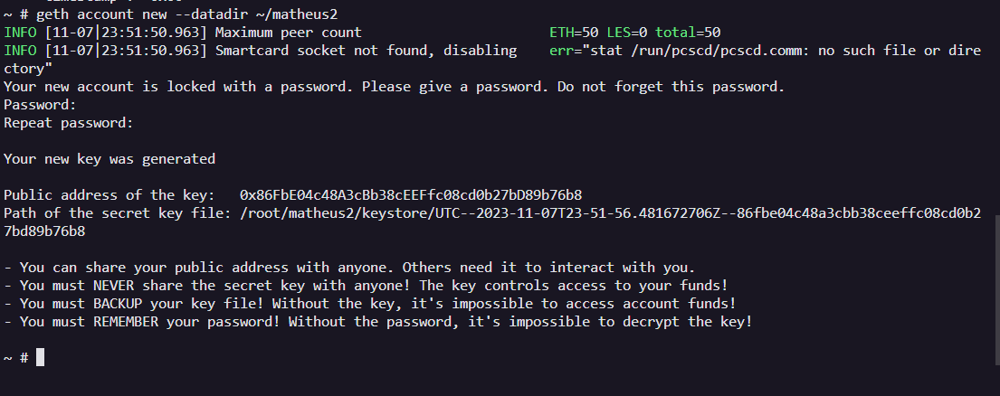

Aluno: Matheus Rafalski
### Requisitos
* Docker

### Criação das Contas
Para facilitar nosso exercício já deixamos pré-criadas as contas em um arquivo que vai ser compartilhado com o container que da máquina da blockchain, o arquivo ficará dessa forma: 

Basta deixa-lo em uma pasta com o nome de **ethereum**.

### Execução do Ambiente
A partir do docker instalado será necessário a imagem **ethereum/client-go:release-1.10** para baixa-la basta executar
 ```bash 
docker pull ethereum/client-go:release-1.10
```
Ao baixar a imagem basta executa-la com: ```bash 
docker run -d --name ethereum-node -v $HOME/ethereum:/root -p 8545:8545 -p 8544:8544 -p 30301:30301 -p 30302:30302 -it --entrypoint=/bin/sh ethereum/client-go:release-1.10
```
Lembre de vincular o caminho da do arquivo das contas corretamente.
    
    
### Criando as contas no ambiente
Basta conectar no ambiente do ethereum e executar e executar:
```bash geth account new --datadir ~/nome_conta
```
Criando as três contas:




Ao criar as contas lembre de substituir as chaves geradas no arquivo das contas criadas previamente para ficarem vinculadas.

matheus1:0xdD1076305Bf5A698D188B56d1BDdB9D1Dce833AB
matheus2:0x86FbE04c48A3cBb38cEEFfc08cd0b27bD89b76b8
matheus3:0x6666799Ee75c74E704BA7860d5FdD4617A5600B6
    
### Inicializando os nós
Para executar os nós de cada conta basta executar o comando: 
```bash 
    geth --datadir /root/nome_conta/ init arquivo.json
```
Lembre de substituir o **nome_conta** pelo nome da sua conta criada e **arquivo.json** pelo nome do seu arquivo criado previamente.

Depois para colocar os nó na rede: 
```bash
geth --datadir ~/nome_conta --networkid 2023 --http --http.api 'txpool,eth,net,web3,personal,admin,miner' --http.corsdomain '*' --authrpc.port 8547 --allow-insecure-unlock console
```
Atente-se ao id da rede e a porta executada para muda-la a cada nó e substituir o **nome_conta** pelo nome da sua conta.
Lembre-se de executar cada nó em um terminal diferente.

### Saldo Inicial
Para ver o saldo de uma conta basta executar 
```bash
eth.getBalance("{chave da conta}")
```


### Mineração
Para minerar basta executar 
```bash
miner.start({número de threads})
```
Para parar a mineração sómente com 
```bash
miner.stop()
```

    
### Transações
Para realizar transações basta executar o comando: 
```bash
eth.sendTransaction({from: "{chave do pagador}", to: "{chave do recebedor}", value: {valor da transação}, gas: {quantidade de 'gás' para executar})
```
Depois basta minerar com a conta para validar a transação, você pode conferir o status da transação com: 
```bash
txpool.status
```


    
### Saldo final


### Novidade
Como novidade trago o 'clef' que pode ser usado para criação de contas e um tipo de autenticador para as transações ou requisições envolvendo a blockchain.
Ele pode ser usado ao instalar uma outra imagem do ethereum-go como a 'ethereum/client-go:alltools-stable' que vem com mais ferramentas na imagem o 'clef' sendo uma delas.
Para criar uma conta no clef basta executar o comando: 
```bash
clef newaccount --keystore dir/keystore
```
a tag keystore diz onde o clef irá guardar as chaves, ao executar o comadno ele vai pedir a senha da conta sendo no mínimo de 10 dígitos.
Exemplo de criação de conta: 
    
