### Mayara de Lourdes Schreiber Meotti


### 1 Atualize o pacote através do comando: 
```
sudo apt update.
```
### 2 Instale o Docker com o seguinte comando: 
```
sudo apt install docker.
```
### 3 Com o Docker instalado, baixe a imagem por meio do comando: 
```
sudo docker pull ethereum/client-go:release-1.10.
```
### 4 Para que um pasta denominada "ethereum" seja criada, use: 
```
mkdir ethereum
```
### 5 No interior da pasta, crie um arquivo denominado "genesis": 
```
nano genesis.json
```
```
No arquivo, colocar a seguinte configuração: {
   "config":{
      "chainId":2023,
      "homesteadBlock":0,
      "eip150Block":0,
      "eip155Block":0,
      "eip158Block":0,
      "byzantiumBlock":0,
      "constantinopleBlock":0,
      "petersburgBlock":0,
      "istanbulBlock":0
   },
   "alloc":{
      "":{
         "balance":"1000"
      },
      "":{
         "balance":"2000"
      },
      "":{
         "balance":"3000"
      }
   },
   "coinbase":"0x0000000000000000000000000000000000000000",
   "difficulty":"0x20000",
   "extraData":"",
   "gasLimit":"0x2fefd8",
   "nonce":"0x0000000000000111",
   "mixhash":"0x0000000000000000000000000000000000000000000000000000000000000000",
   "parentHash":"0x0000000000000000000000000000000000000000000000000000000000000000",
   "timestamp":"0x00"
}
```
### 6 Para rodar o container, utilize: 
```
sudo docker run -d --name ethereum-node -v $HOME/ethereum:/root -p 8545:8545 -p 8544:8544 -p 30301:30301 -p 30302:30302 -p 30303:30303 -p 30304:30304 -it --entrypoint=/bin/sh ethereum/client-go:release-1.10
```
### 7 Em seguida, 3 novos terminais foram iniciados e o conteiner foi iniciado por meio do comando: 
```
sudo docker exec -it ethereum-node sh 
```
### 8 Uma vez nos terminais, o seguinte comando deve ser utilizado para acessar a pasta root.
```
cd /root
```
### 9 Na sequência, para puxar o arquivo para pasta root:  
```
cat genesis.json
```
### 10 As contas foram criadas, todas com nomes diferentes - mayara1, mayara2, mayara3 -, através do comando: 
```
geth account new --datadir ~/(nome).
```
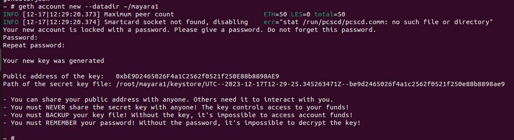
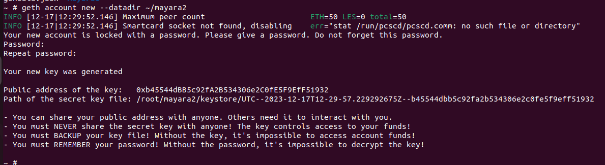
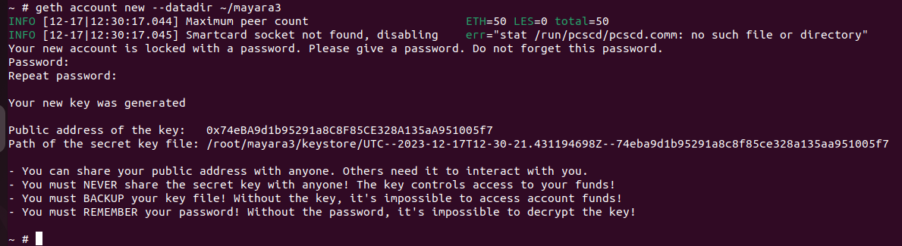


### 11 As chaves públicas, geradas anteriormente, devem ser colocadas no arquivo "genesis.json"

### 12 Os nós da rede usam, para cada terminal, o comando:
```
geth --datadir /root/mayara1/ init genesis.json
geth --datadir /root/mayara2/ init genesis.json
geth --datadir /root/mayara3/ init genesis.json
```
### 13 Para que os nós sejam executados, utilize:
```

### 2º terminal: 
	
geth --datadir ~/mayara1 --networkid 2023 --http --http.api 'txpool,eth,net,web3,personal,admin,miner' --http.corsdomain '*' --authrpc.port 8547 --allow-insecure-unlock console
	
### 3º terminal:
	
geth --datadir ~/mayara2 --networkid 2023 --http --http.api 'txpool,eth,net,web3,personal,admin,miner' --http.corsdomain '*' --authrpc.port 8546 --port 30302 --http.port 8544 --allow-insecure-unlock console
	
### 4º terminal:
	
geth --datadir ~/mayara3 --networkid 2023 --http --http.api 'txpool,eth,net,web3,personal,admin,miner' --http.corsdomain '*' --authrpc.port 8548 --port 30500 --http.port 30501 --allow-insecure-unlock console

```
### 14 Para verificar se o saldo estar correto, escolha uma conta para o teste através do comando: 
```
eth.getBalance("chave_publica")
```
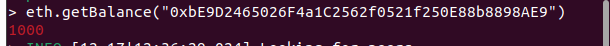
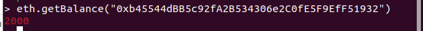
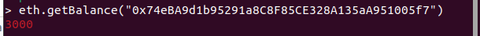


### 16 Feito isso, a mineração deve ser iniciada via: 
```
miner.start(10)
```

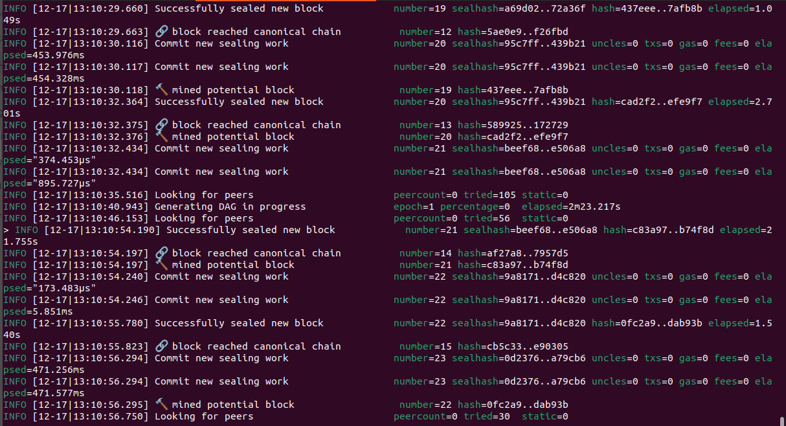
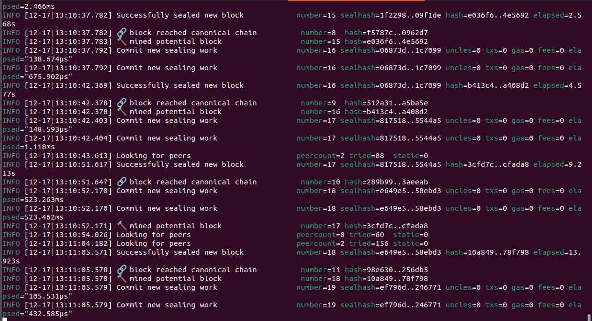
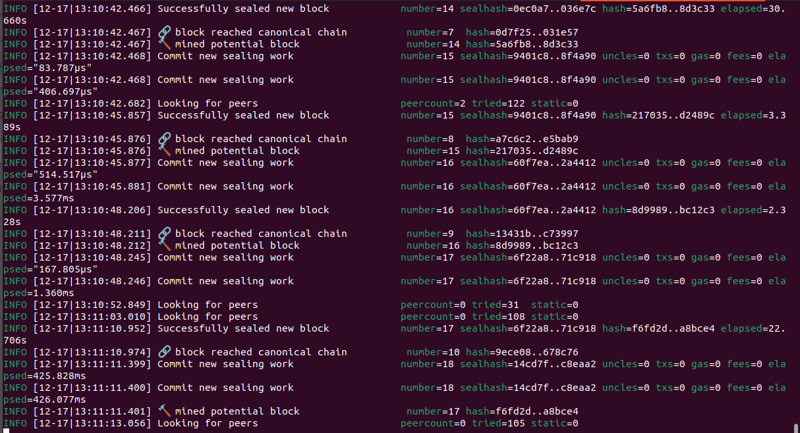

### 17 Para encerrar o processo: 
```
miner.stop(10)
```
### 18 A verificação do funcionamento da mineração pode ser feita via comando: 
```
eth.getBalance("chave_publica")	
```
### 19 A transição ocorre depois da liberação das contas, isso deve ser feito pelo comando:
```
eth.sendTransaction({from:"chave_publica_envia", to:"chave_publica_recebe", value:Valor, gas:21000})
```

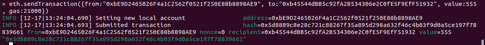
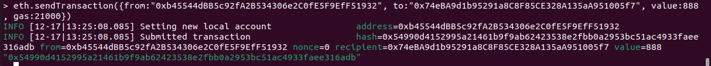


### 20 Conferir o saldo final: 
```
eth.getBalance("chave_publica")
```
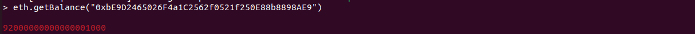
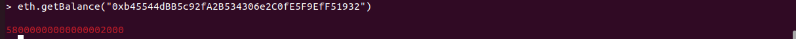


NOVIDADE!

### 21 A novidade consiste em 2 novidades. 

### 22 A primeira envolve a obtenção da conta que receberá as recompensas da mineração. Deve ser utilizado o seguinte comando: 
```
eth.coinbase
```
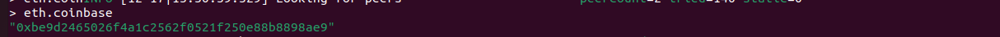

### 23 A outra está relacionada a obtenção do preço atual do gás na rede e pode ser acessada via: 
```
eth.gasPrice
```

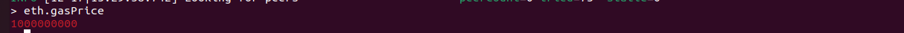

### GIT PUSH


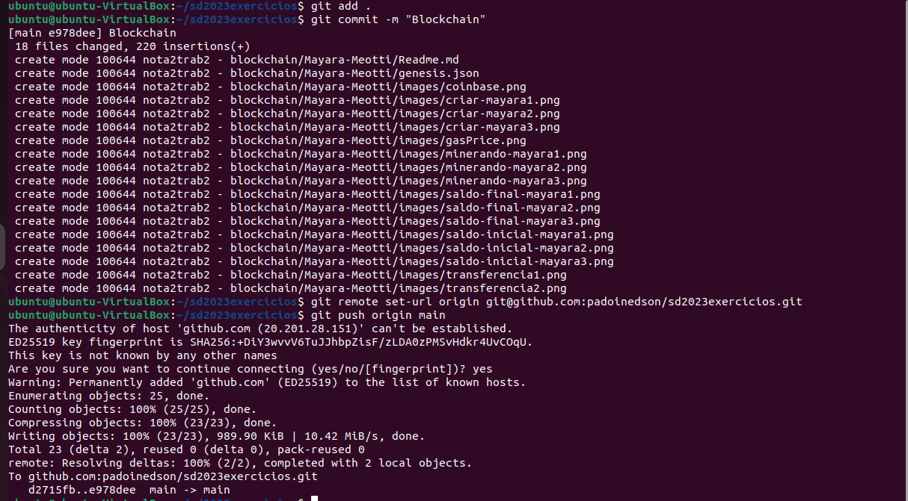


