## Blockchain

Nome: Renan L. Dambrós

1. Instale o Docker.
```bash
    sudo apt install docker
```
    
```bash
    sudo apt install docker.io
```
    
2. Baixe a imagem 'ethereum/client-go':
```bash
    sudo docker pull ethereum/client-go:release-1.10
```

3. Crie um diretório chamado 'ethereum':
```bash
    mkdir ethereum
```
    
4. Entre na pasta
```bash
    cd ethereum
```
    
5. Crie o arquivo `genesis.json`:
```bash
    nano genesis.json
```

6. . Cole e salve o seguinte conteúdo:
```json
    {
        "config": {
            "chainId": 2023,
            "homesteadBlock": 0,
            "eip150Block": 0,
            "eip155Block": 0,
            "eip158Block": 0,
            "byzantiumBlock": 0,
            "constantinopleBlock": 0,
            "petersburgBlock": 0,
            "istanbulBlock": 0
        },
        "alloc": {
            "0x90bA23C7A92C7d524E5B5cc9D6dA30D65Ba30944": {
                "balance": "5000"
            },
            "0x90F8BE615B29B10B2E4B9BbF3ae17B970c86b955": {
                "balance": "6000"
            }
        },
        "coinbase": "0x0000000000000000000000000000000000000000",
        "difficulty": "0x20000",
        "extraData": "",
        "gasLimit": "0x2fefd8",
        "nonce": "0x0000000000000111",
        "mixhash": "0x0000000000000000000000000000000000000000000000000000000000000000",
        "parentHash": "0x0000000000000000000000000000000000000000000000000000000000000000",
        "timestamp": "0x00"
    }
```
    
7. Saia da pasta:
```bash
    cd ..
```

8. Execute o container:
```bash
    sudo docker run -d --name ethereum-node -v $HOME/ethereum:/root -p 8545:8545 -p 8544:8544 -p 30301:30301 -p 30310:30310 -p 30320:30320 -p 30330:30330 -it --entrypoint=/bin/sh ethereum/client-go:release-1.10
```

9. Abra 3 terminais. Acesse o container, de um ls e verifique se o arquivo `genesis.json` está presente:
```bash
    sudo docker exec -it ethereum-node sh
```
    
```bash
    cd /root
```
    
```bash
    ls
```

9. Crie contas usando o comando:
```bash
    geth account new --datadir ~/renan1
```
    
```bash
    geth account new --datadir ~/renan2
```
    
```bash
    geth account new --datadir ~/renan3
```
    
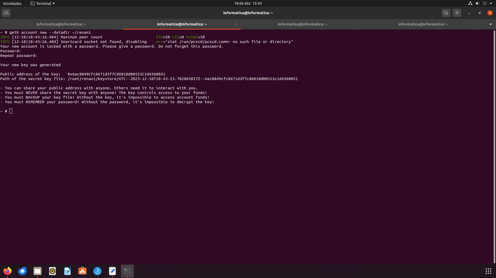
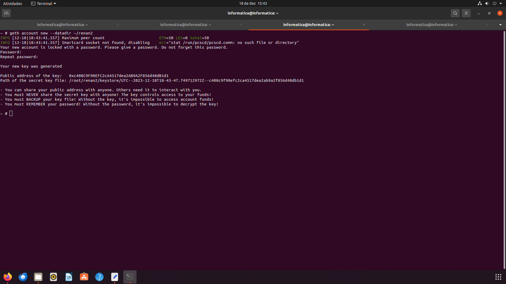
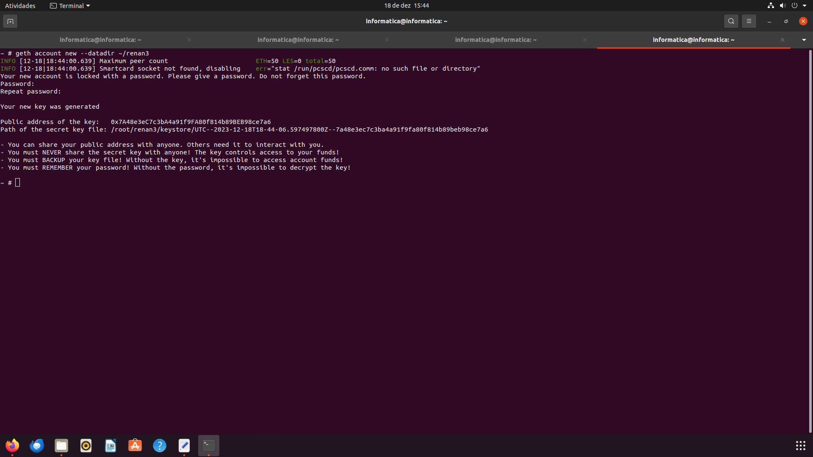


10. Copie a chave pública e atualize o arquivo `genesis.json`.

```json
    {
        "config": {
            "chainId": 2023,
            "homesteadBlock": 0,
            "eip150Block": 0,
            "eip155Block": 0,
            "eip158Block": 0,
            "byzantiumBlock": 0,
            "constantinopleBlock": 0,
            "petersburgBlock": 0,
            "istanbulBlock": 0
        },
        "alloc": {
            "0x6ac8849CFc8671d3f7Cd6018d00553C1d4360051": {
                "balance": "1000"
            },
            "0xc408C9F90EFC2cA4517dea2AB9A2F856d48dB1d1": {
                "balance": "2000"
            },
            "0x7A48e3eC7c3bA4a91f9FA80f814b89BEB98ce7a6": {
                "balance": "3000"
            }
        },
        "coinbase": "0x0000000000000000000000000000000000000000",
        "difficulty": "0x20000",
        "extraData": "",
        "gasLimit": "0x2fefd8",
        "nonce": "0x0000000000000111",
        "mixhash": "0x0000000000000000000000000000000000000000000000000000000000000000",
        "parentHash": "0x0000000000000000000000000000000000000000000000000000000000000000",
        "timestamp": "0x00"
    }
```

11. Inicie os nós na rede:
```bash
    geth --datadir /root/renan1/ init genesis.json
```
    
```bash
    geth --datadir /root/renan2/ init genesis.json
```
    
```bash
    geth --datadir /root/renan3/ init genesis.json
```

12. Rode os nós na rede:
```bash
    geth --datadir ~/renan1 --networkid 2023 --http --http.api 'txpool,eth,net,web3,personal,admin,miner' --http.corsdomain '*' --authrpc.port 8547 --allow-insecure-unlock console
```

```bash
    geth --datadir ~/renan2 --networkid 2023 --http --http.api 'txpool,eth,net,web3,personal,admin,miner' --http.corsdomain '*' --authrpc.port 8546 --port 30302 --http.port 8544 --allow-insecure-unlock console
```

```bash
    geth --datadir ~/renan3 --networkid 2023 --http --http.api 'txpool,eth,net,web3,personal,admin,miner' --http.corsdomain '*' --authrpc.port 8548 --port 30500 --http.port 30501 --allow-insecure-unlock console
```

13. Em cada terminal, use a chave respectiva para verificar o saldo da conta:
```bash
    eth.getBalance("0x6ac8849CFc8671d3f7Cd6018d00553C1d4360051")
```
    
```bash
    eth.getBalance("0xc408C9F90EFC2cA4517dea2AB9A2F856d48dB1d1")
```
    
```bash
    eth.getBalance("0x7A48e3eC7c3bA4a91f9FA80f814b89BEB98ce7a6")
```
    
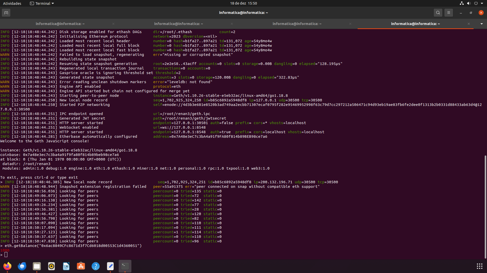
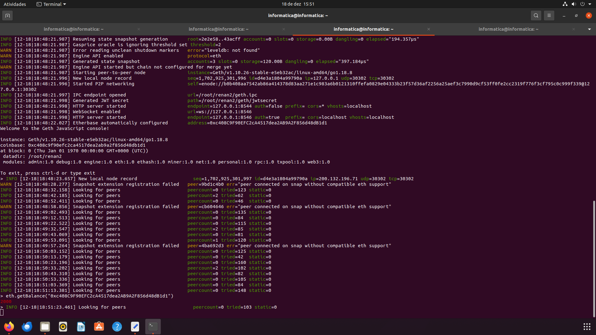
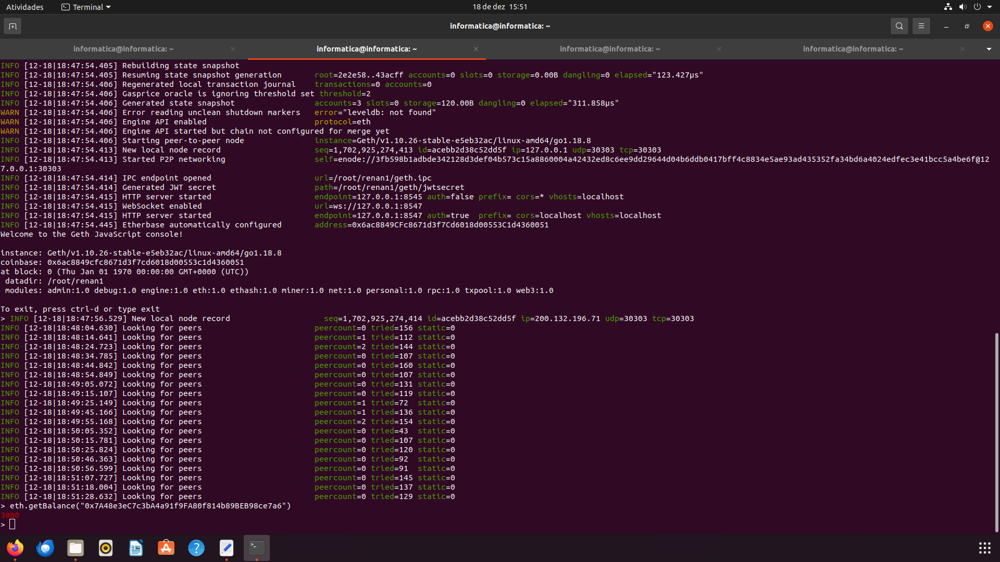

14. Inicie a mineração:
```bash
    miner.start(10)
```
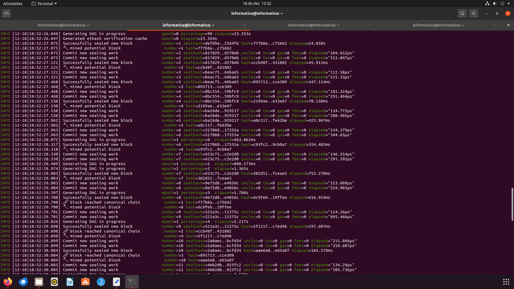

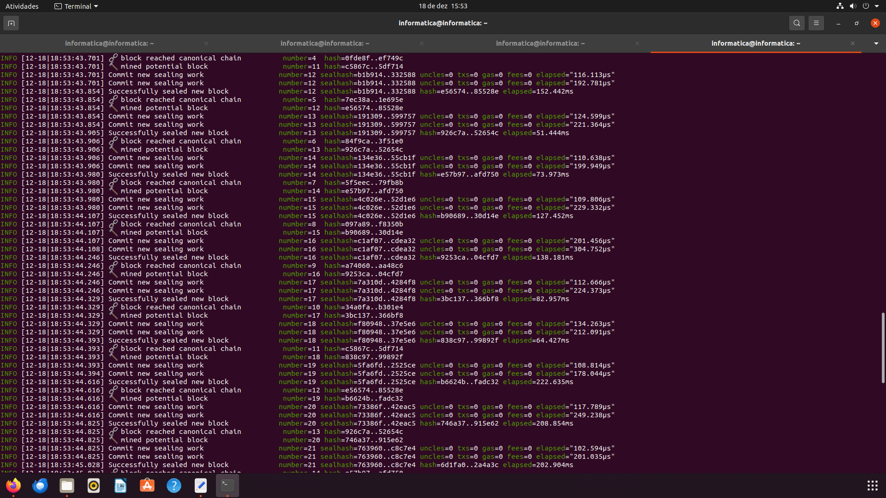

15. Pare a mineração:
```bash
    miner.stop()
```

16. Desbloqueie as contas para transações colando o comando abaixo e digitando a senha escolhida pra conta:
```bash
    personal.unlockAccount("0x6ac8849CFc8671d3f7Cd6018d00553C1d4360051")
```
    
```bash
    personal.unlockAccount("0xc408C9F90EFC2cA4517dea2AB9A2F856d48dB1d1")
```
    
```bash
    personal.unlockAccount("0x7A48e3eC7c3bA4a91f9FA80f814b89BEB98ce7a6")
```

17. Transações entre contas: Primeira conta para a segunda:
```bash
    eth.sendTransaction({from:"0x6ac8849CFc8671d3f7Cd6018d00553C1d4360051", to:"0xc408C9F90EFC2cA4517dea2AB9A2F856d48dB1d1", value:111, gas:21000})
```
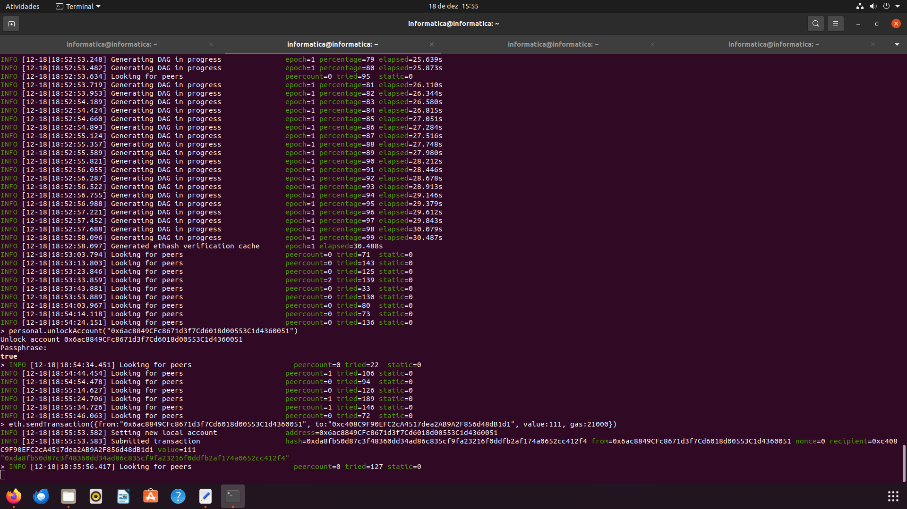

18. Segunda conta para a terceira:
```bash
    eth.sendTransaction({from:"0xc408C9F90EFC2cA4517dea2AB9A2F856d48dB1d1", to:"0x7A48e3eC7c3bA4a91f9FA80f814b89BEB98ce7a6", value:222, gas:21000})
```
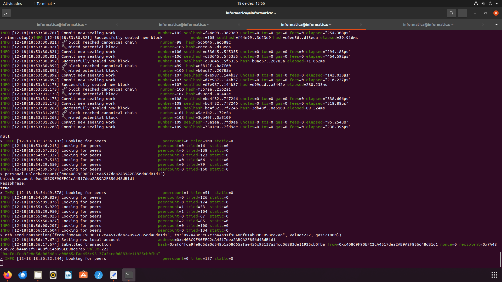

19. Verifique o pool de transações:
```bash
    txpool.status
```

20. Inicie a mineração para confirmar transações:
```bash
    miner.start(10)
```

21. Pare a mineração para efetuar as transações:
```bash
    miner.stop()
```

22. Verifique o saldo novamente para cada conta:
```bash
    eth.getBalance("0x6ac8849CFc8671d3f7Cd6018d00553C1d4360051")
```
    
```bash
    eth.getBalance("0xc408C9F90EFC2cA4517dea2AB9A2F856d48dB1d1")
```
    
```bash
    eth.getBalance("0x7A48e3eC7c3bA4a91f9FA80f814b89BEB98ce7a6")
```
    
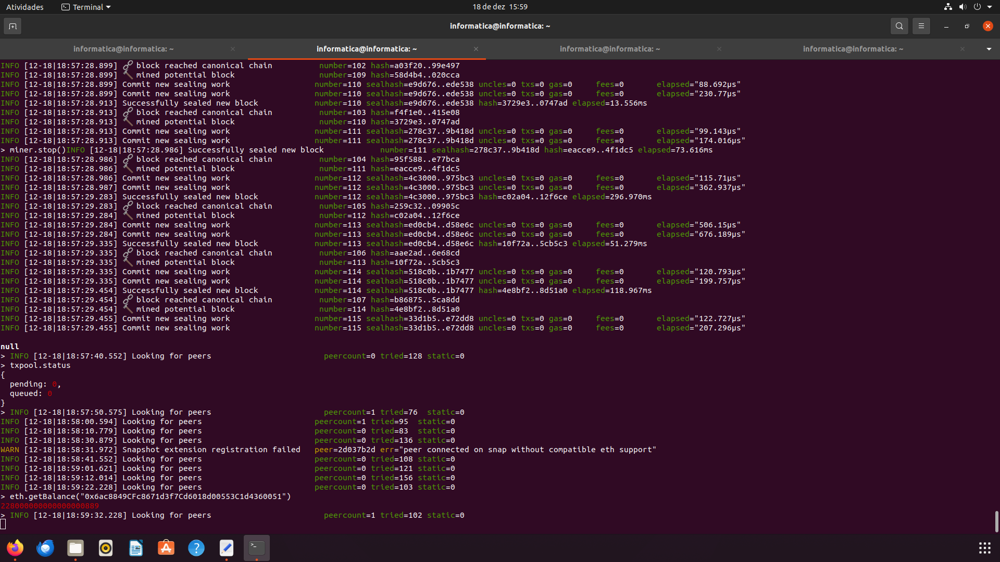
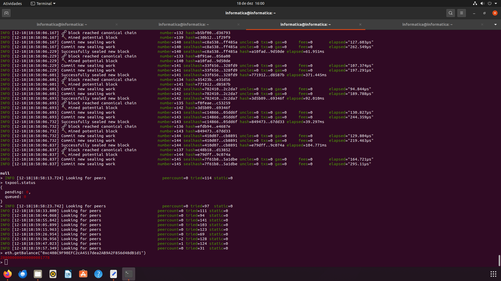


## Novidade

- `eth.estimateGas`: Este comando estima o consumo de gás para uma transação.
```bash
    eth.estimateGas({from: "0x6ac8849CFc8671d3f7Cd6018d00553C1d4360051", to: "0xc408C9F90EFC2cA4517dea2AB9A2F856d48dB1d1", value: web3.toWei(1, "ether")})
```

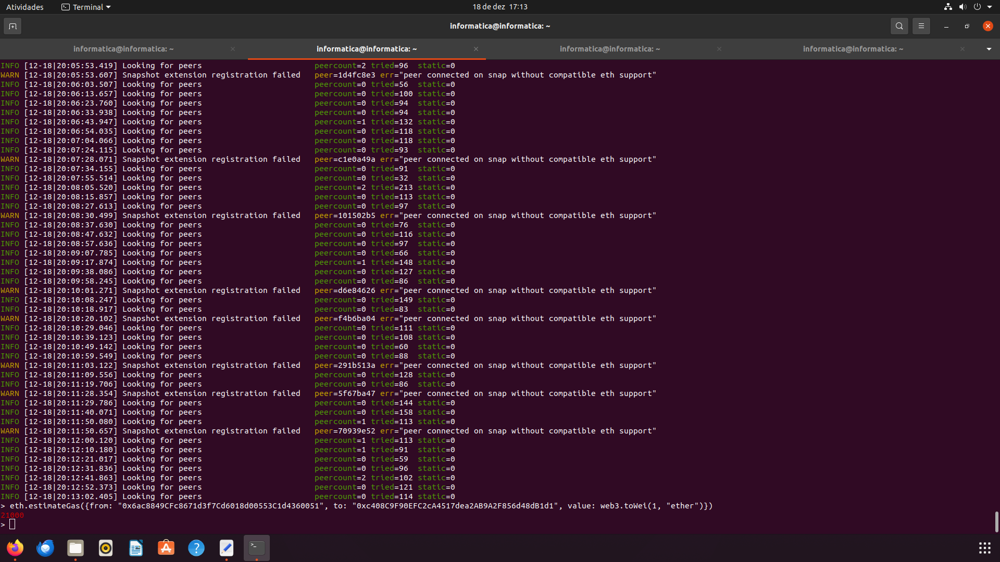
    

