
# Ethereum Blockchain + Memento
Este documento tem como objetivo apresentar um passo a passo detalhando a instalação e a utilização básica de uma blockchain de Ethereum em um sistema Linux através de contêiners Docker, para fins de teste e aprendizado. Para o cliente Ethereum será utilizada a ethereum-go, que é uma implementação do protocolo Ethereum feita em Go. A sua escolha deve-se ao fato de ela fornecer algumas ferramentas interessantes que facilitam a administração da blockchain, como a CLI geth. Além disso, também será demonstrada a integração da blockchain com o serviço Memento, que é um explorador de blocos, a fim de investigar e observar através de uma interface gráfica as operações que serão realizadas na blockchain.
> Autor: Bruno Moretto Monegat

## Pré-requisitos
* Sistema operacional baseado em Linux;
* wget;
* Docker;
* Docker Compose.

## Criação do Contêiner
**Dentro do diretório raiz do projeto**, execute o seguinte comando para criar a imagem personalizada do go-ethereum:
```bash
$ sudo docker build -t custom-eth-img .
```

Agora execute o seguinte comando para criar o contêiner e acessá-lo:
```bash
$ sudo docker run --name eth-client -it custom-eth-img
```

## Adição das Contas
**Dentro do contêiner**, execute o seguinte comando para criar uma nova conta associada ao **node-1**, fornecendo uma senha quando solicitado:
```bash
$ geth --datadir ~/node-1 account new
```
> Não se esqueça de tomar nota da senha da conta, já que ela será necessária para acessos futuros! 

Copie o endereço público da conta que foi gerado durante a sua criação:

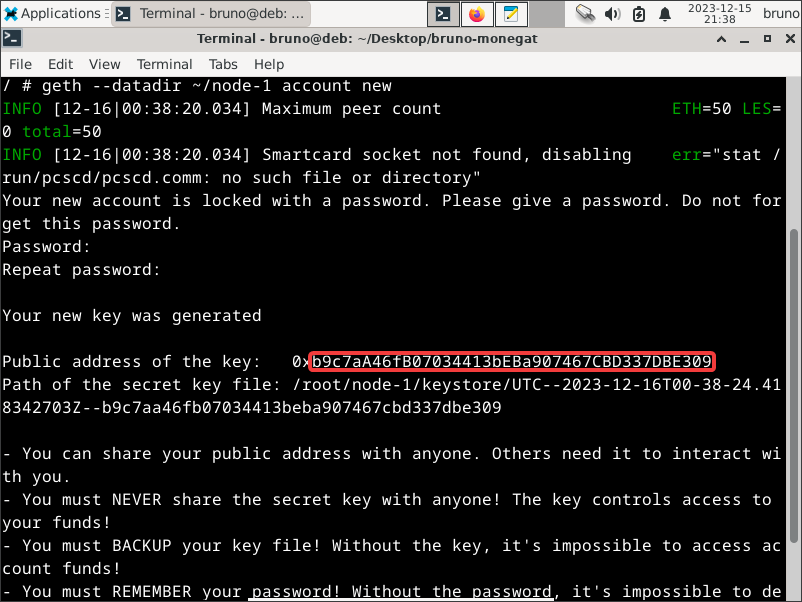
> Note que o endereço a ser copiado começa depois do "0x"! 

Abra o arquivo **``genesis.json``**, localizado em **``~/genesis.json``**, através de um editor de texto:
```bash
$ vi ~/genesis.json
```
> Nesse exemplo fui usado o **vi** pois ele já vem instalado na imagem do contêiner.

 Adicione a seguinte linha de código dentro do objeto **"alloc"**, substituindo **\<address>** pelo endereço público da conta que acabou de ser salvo, e **\<amount>** pela quantidade de moeda inicial desejada da conta:
```json
"<address>": { "balance": "<amount>" }
```
> Caso hajam mais registros de contas dentro do objeto **"alloc"**, lembre-se de adicionar uma vírgula ao final do último registro antes de incluir o novo!

Agora repita todos os passos anteriores mais duas vezes para adicionar e configurar as outras duas contas. 
> Lembre-se de substituir **node-1** por **node-2** e depois por **node-3**, respectivamente, durante a execução do primeiro comando, já que cada conta deverá estar associada a um node específico.

## Configuração dos Nodes
Faça uma cópia do arquivo **``~/genesis.json``** para dentro do diretório do **node-1**:
```bash
$ cp ~/genesis.json ~/node-1
```

Para configurar o node a partir do bloco inicial descrito no genesis, basta executar o seguinte comando:
```bash
$ geth init --datadir ~/node-1 ~/node-1/genesis.json
```

Agora repita todos os passos anteriores mais duas vezes para configurar os outros dois nodes. 
> Lembre-se de substituir **node-1** por **node-2** e depois por **node-3**, respectivamente, durante a execução dos comandos.

## Acessando os Nodes
Localize e anote o endereço IP do contêiner através desse comando:
```bash
$ ifconfig
```

Execute o seguinte comando para acessar a CLI Javascript do primeiro node, alterando **\<ip>** pelo endereço recém copiado:
```bash
$ geth --datadir ~/node-1 --networkid 12345 --http --http.api "txpool,eth,net,web3,personal,admin,miner" --http.corsdomain "*" --port 8551 --authrpc.port 8552 --http.address "<ip>" --http.port 30305 --allow-insecure-unlock console
```

Agora abra um segundo terminal e acesse o contâiner a partir dele usando o seguinte comando:
```bash
$ sudo docker exec -it eth-client sh 
```

Novamente, execute o seguinte comando para acessar a CLI Javascript, porém agora do segundo node, alterando **\<ip>** pelo endereço copiado previamente:
```bash
$ geth --datadir ~/node-2 --networkid 12345 --http --http.api "txpool,eth,net,web3,personal,admin,miner" --http.corsdomain "*" --port 8553 --authrpc.port 8554 --http.address "<ip>" --http.port 30306 --allow-insecure-unlock console
```
> Lembre-se de anotar o **enode** que foi impresso durante a inicialização!

Voltando ao **1° terminal**, execute o seguinte comando para parear com o node recém inicializado, substituindo **\<enode-2>** pelo enode que foi impresso durante a inicialização do **node-2**:
```js
> admin.addPeer("<enode-2>")
```
> A CLI **``geth``** permite o uso de Javascript para facilitar a interação com a blockchain. Ela também se encarrega de repassar as funções evocadas como chamadas RPC ao cliente Ethereum.

Por fim, abra um terceiro terminal e acesse o **``sh``** usando o docker como foi feito anteriormente. Após isso, use o seguinte comando para acessar a CLI Javascript, do terceiro node, alterando **\<ip>** pelo endereço copiado previamente:
```bash
$ geth --datadir ~/node-3 --networkid 12345 --http --http.api "txpool,eth,net,web3,personal,admin,miner" --http.corsdomain "*" --port 8555 --authrpc.port 8556 --http.address "<ip>" --http.port 30307 --allow-insecure-unlock console
```
> Lembre-se de anotar o **enode** que foi impresso durante a inicialização!

Novamente, voltando ao **1° terminal**, execute o seguinte comando para parear com o node recém inicializado, substituindo **\<enode-3>** pelo enode que foi impresso durante a inicialização do **node-3**:
```js
> admin.addPeer("<enode-3>")
```

Ao final da execução dos comandos desse tópico, deverão estar abertas 3 janelas (ou abas) diferentes do terminal, sendo a 1° referente ao CLI do **node-1**, a 2° ao do **node-2** e a 3° ao do **node-3**.

## Efetuando Transações
Ao executar o seguinte código, é possível ver as contas registradas em cada node:
```js
> eth.accounts
```
> Como cada node está relacionado a uma conta específica, a 1° conta aparecerá na lista de contas **node-1**, a 2° na do **node-2** e assim por diante...

Para checar o saldo inicial das contas, basta executar a seguinte linha de código na CLI em cada um dos terminais:
```js
> personal.getBalance(eth.accounts[0])
```

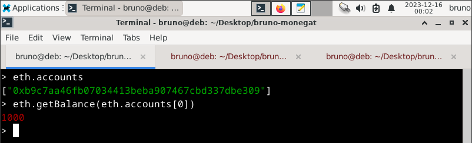
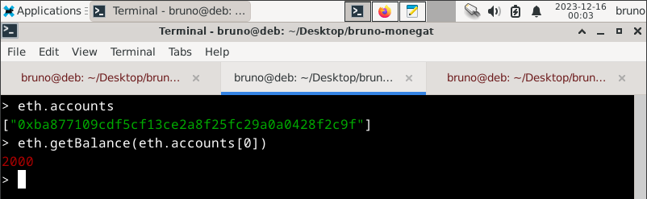
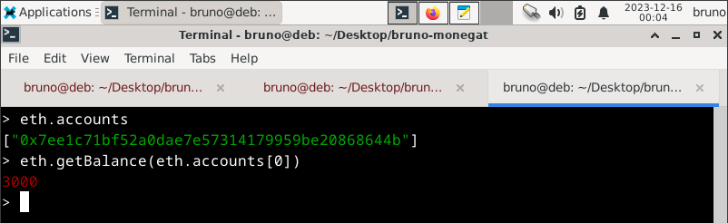

Antes de se fazer qualquer transação, a conta que irá transferir as moedas precisa ser desbloqueada:
```js
> personal.unlockAccount(eth.accounts[0])
```
> Note que será solicitada a senha da conta, a qual foi definida na sua criação.

Agora, para fazer uma transação de 111 moedas da conta no **node-1** para a conta no **node-2**, basta executar o seguinte comando no **1° terminal**, substituindo **\<address-2>** pelo endereço público da segunda conta:
```js
> eth.sendTransaction({ to: <address-2>, from: eth.accounts[0], value: 111, gas: 21000 });
```
> Note que a transação só será efetivada quando um novo bloco for minerado.

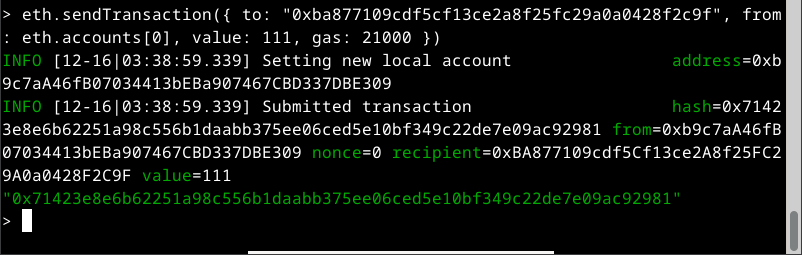

Esses passos podem ser repetidos para fazer uma transação de 222 moedas da conta no **node-2** para a conta no **node-3**. Para isso, basta executar o seguinte comando no **2° terminal**, substituindo **\<address-3>** pelo endereço público da terceira conta:
```js
> eth.sendTransaction({ to: <address-3>, from: eth.accounts[0], value: 222, gas: 21000 });
```
> Lembre-se de desbloquear a conta do **node-2** primeiro!

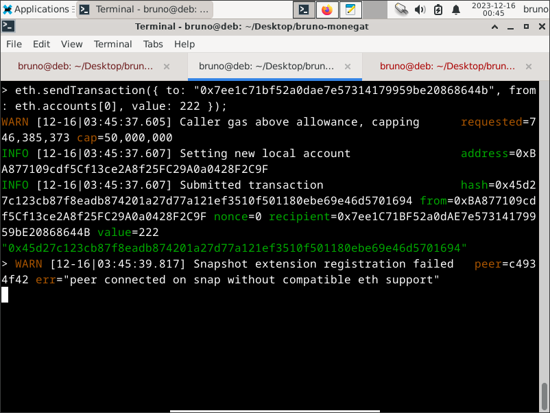

## Minerando Blocos
Para minerar blocos a fim de efetivar transações, deve-se executar a seguinte linha de código na CLI de algum dos nodes:
```js
> miner.start(5)
```

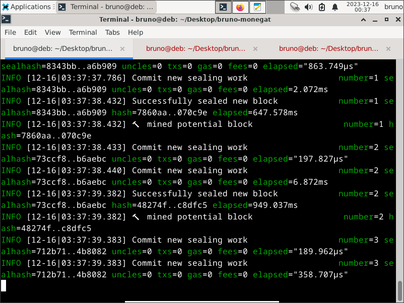

Para parar a mineração, use a seguinte linha de código:
```js
> miner.stop()
```
> Talvez seja necessário esperar a DAG ser gerada para parar pela primeira vez.

Caso tudo tenha ocorrido como planejado, as transações entre as contas devem ter sido efetivadas com sucesso! Para checar o saldo final das contas, pode-se usar esse código, o qual já foi apresentado anteriormente, em cada um dos terminais: 
```js
> personal.getBalance(eth.accounts[0])
```

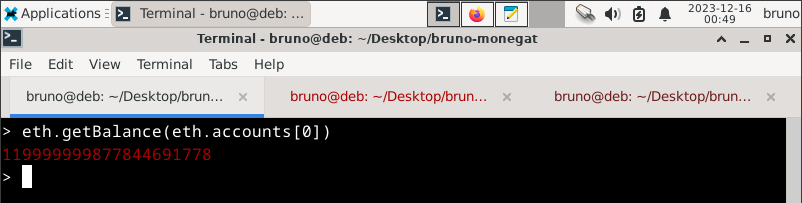
> Nesse caso, como o **node-1** foi usado para minerar, a sua conta acabou acumulando muitas moedas ao final do processo. 

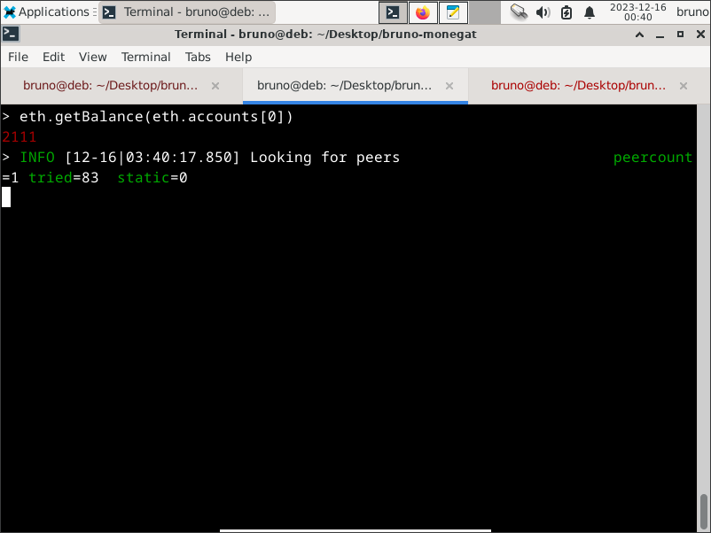
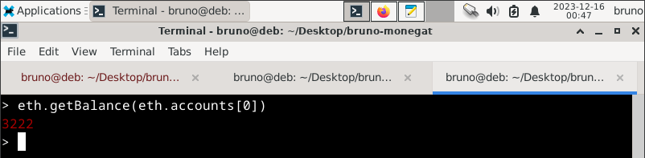

## Integração com o Memento
Comece abrindo um novo terminal **fora do contêiner** e criando um novo diretório para ser usado como local de instalação do serviço:
```bash
$ mkdir memento
$ cd memento
```

Agora faça o download dos arquivos de configuração padrão:
```bash
$ wget -q --show-progress https://raw.githubusercontent.com/Alethio/memento/master/docker-compose-explorer.yml
$ wget -q --show-progress https://raw.githubusercontent.com/Alethio/memento/master/config-sample.yml
$ wget -q --show-progress https://raw.githubusercontent.com/Alethio/memento/master/lite-explorer.config.json
```

Crie diretórios separados para armazenar as configurações específicas: 
```bash
$ mkdir -p .volumes/memento
$ mkdir -p .volumes/lite-explorer
$ mv config-sample.yml .volumes/memento/config.yml
$ mv lite-explorer.config.json .volumes/lite-explorer/config.json
```
> O diretório **``.volume``** será montado dentro do contêiner pelo docker-compose durante a inicialização.

Abra o seguinte arquivo de configurações em algum editor de texto:
```bash
$ vi .volumes/memento/config.yml
```

Localize o seguinte trecho de código dentro do arquivo:
```yaml
...

# ethereum-related fields
eth:
  client:
    # HTTP endpoint of a web3-compatible node (mandatory)
    http: "http://localhost:8545"

    # Websockets endpoint of JSON-RPC enabled node (optional)
    # if this is present, the task manager will use a newHeads subscription to watch for new blocks
    # if not present, the task manager will use polling to get the highest block
    ws: "ws://localhost:8546"

    # The interval at which the task manager will poll the node for best block (default:"15s")
    # optional, only used if `ws` url is not specified
    poll-interval: "15s"
    
...
```

Substitua esse trecho localizado pelo seguinte trecho de código, fazendo as mudanças necessárias e alterando **\<ip>** pelo endereço de IP do contêiner que está executando os nodes ethereum:
```yaml
...

# ethereum-related fields
eth:
  client:
    # HTTP endpoint of a web3-compatible node (mandatory)
    http: "http://<ip>:30305"

    # Websockets endpoint of JSON-RPC enabled node (optional)
    # if this is present, the task manager will use a newHeads subscription to watch for new blocks
    # if not present, the task manager will use polling to get the highest block
    # ws: "ws://localhost:8546"

    # The interval at which the task manager will poll the node for best block (default:"15s")
    # optional, only used if `ws` url is not specified
    poll-interval: "15s"

...
``` 
> Nesse caso, o Memento e o Ethereum Lite Explorer deverão se conectar à API HTTP-RPC do **node-1**, tendo acesso às principais funções disponíveis na blockchain.

Inicie o contêiner atráves do seguinte comando:
```bash
$ sudo docker-compose -f docker-compose-explorer.yml up -d
```

A interface do Ethereum Lite Explorer pode ser acessada através do http://localhost:

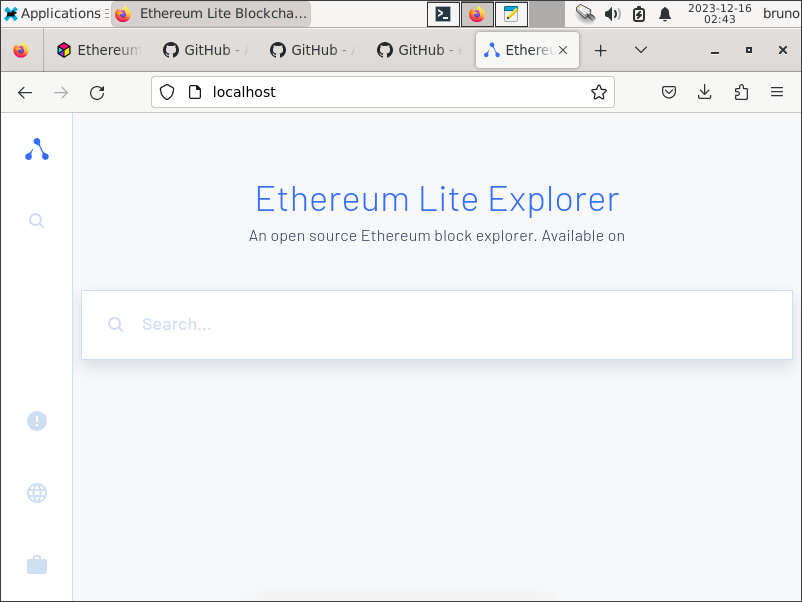

Por fim, através do http://localhost:3000 e do http://localhost:80 é possível acessar a dashboard e o explorador do Memento.

## Comandos Git
- Git Add:
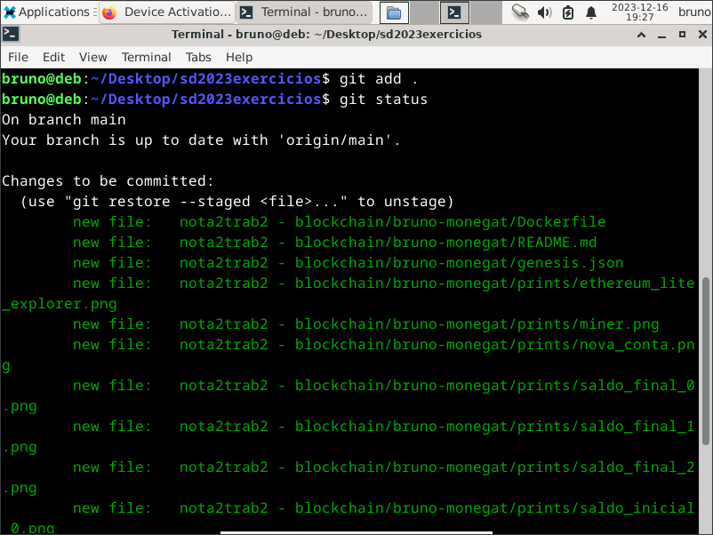

- Git Commit:
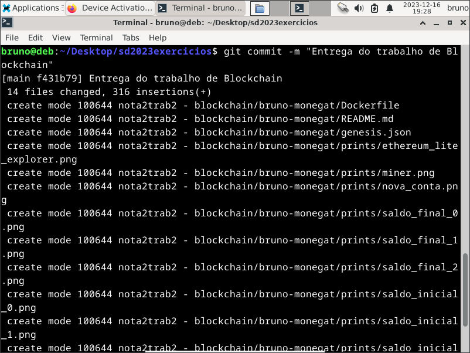

- Git Push:
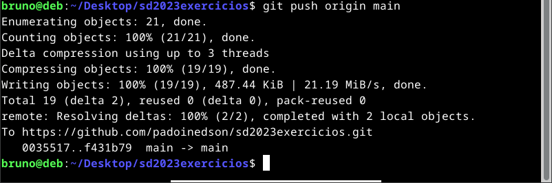

## Referências
- Documentação oficial do go-ethereum para redes privadas: https://geth.ethereum.org/docs/fundamentals/private-network
- Documentação oficial do Memento para instalação junto com o Ethereum Lite Explorer: https://alethio.gitbook.io/memento/running-memento/bundled-with-lite-explorer
