## Blockchain

Nome: Diego Rafael Kalschne

# Instalação do Docker
Precisaremos utilizar o Docker para a conclusão deste trabalho, vamos começar instalando ele.
1. Atualizar as dependências e repositórios (lista de pacotes) do Ubuntu: `sudo apt update`
2. Instalar o Docker com: `sudo apt install docker`
3. Instalação do Docker.io com: `sudo apt install docker.io`

# Imagem Docker
Baixaremos agora a imagem Docker com o ethereum já configurado
1. Executar `sudo docker pull ethereum/client-go:release-1.10`

# Criação de arquivo genesis.json
1. Crie um arquivo chamado `genesis.json` dentro de uma pasta chamada `ethereum`. Nele, cole o seguinte conteúdo:
```
{
   "config":{
      "chainId":2023,
      "homesteadBlock":0,
      "eip150Block":0,
      "eip155Block":0,
      "eip158Block":0,
      "byzantiumBlock":0,
      "constantinopleBlock":0,
      "petersburgBlock":0,
      "istanbulBlock":0
   },
   "alloc":{
      "":{
         "balance":"1000"
      },
      "":{
         "balance":"2000"
      },
      "":{
         "balance":"3000"
      }
   },
   "coinbase":"0x0000000000000000000000000000000000000000",
   "difficulty":"0x20000",
   "extraData":"",
   "gasLimit":"0x2fefd8",
   "nonce":"0x0000000000000111",
   "mixhash":"0x0000000000000000000000000000000000000000000000000000000000000000",
   "parentHash":"0x0000000000000000000000000000000000000000000000000000000000000000",
   "timestamp":"0x00"
}
```
Futuramente, iremos ainda alterar o conteúdo do grupo "alloc". Inicialmente, apenas declaramos 3 contas, cada uma com um saldo inicial de 1000, 2000 e 3000 Ethers (moeda da rede Ethereum), respectivamente.
Neste caso, criei esse arquivo no diretório home do usuário, para chegar lá, execute `cd ~`.

# Criando Container
Vamos agora rodar um container a partir da imagem previamente baixada.
1. Executar `sudo docker run -d --name eth -v $HOME/ethereum:/root -p 8545:8545 -p 8544:8544 -p 30301:30301 -p 30302:30302 -p 3000:3000 -it --entrypoint=/bin/sh ethereum/client-go:release-1.10`
- Criamos um container que faz uso de um volume, ligando a pasta "ethereum" (onde criamos o arquivos genesis.json) com a pasta "/root" (que está dentro do container).
- Nome do container de "eth"
2. Podemos verificar a execução do container com `sudo docker ps`

# Criação de Contas
1. Entrar no container criado executando `sudo docker exec -it eth sh`. Observe que o nome "eth" é o nome dado ao container no momento da sua criação
2. Faça o passo `1.` em mais dois terminais diferentes.
3. Em cada novo terminal, execute o seguinte comando para criar uma nova conta: `geth account new --datadir ~/NOME`. Substitua o [NOME] por algo da sua preferência, mas que seja único para cada usuário. Exemplo: `geth account new --datadir ~/diego1`
> Neste momento, será solicitado a criação de uma senha para cada usuário. Crie uma e não a esqueça.
4. Observe o console após a criação de cada conta, você recebeu uma chave pública. Copie-a e cole em um arquivo de texto de momento, identificando cada usuário.

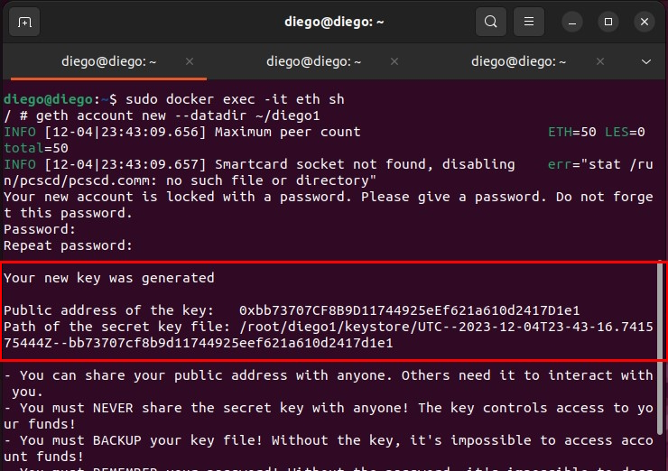

É a chave pública que nos identificará dentro da rede de blockchain e permitirá que façamos transações dentro dela. Por isso é importante não a perdermos.
Observe também no console que você recebe o caminho para a sua chave privada, é importante que esta chave *nunca* seja compartilhada com ninguém, pois assim, qualquer pessoa teria acesso a sua conta.

# Linkando as chaves públicas com as contas
Ao criarmos o arquivo genesis.json, apenas declaramos 3 contas com um saldo inicial, porém não a identificamos de nenhuma forma. Vamos fazer isso agora com as chaves públicas.
1. No arquivo `genesis.json`, criado fora do container, altere a seção `alloc`, colocando a chave pública de cada conta nas "" (aspas) de cada conta.

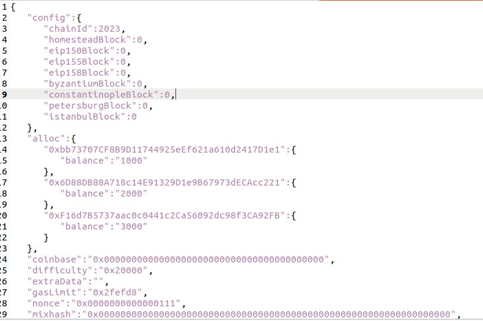

Ao final, seu arquivo deverá ter uma aparência parecido com esta. Salve o arquivo na sequência.
> Importante salientar que a chave pública sempre será diferente para cada conta criada.

# Inicializando os nós da rede
1. Ir até o diretório root com `cd /root`
2. Inicializar o nó com o comando `geth --datadir /root/NOME/ init genesis.json`. Cuide para trocar o [NOME] com o nome do usuário que você criou.
> Repita o passo `2.` para os três usuários diferentes (em cada terminal diferente)

# Colocando os nós para rodar
Vamos iniciar agora cada nó nada rede:
1. No primeiro usuário (terminal), execute:
```
geth --datadir ~/NOME --networkid 2023 --http --http.api 'txpool,eth,net,web3,personal,admin,miner' --http.corsdomain '*' --authrpc.port 8547 --allow-insecure-unlock console
```
> Cuide para alterar o nome do usuário

2. No segundo usuário (terminal), execute:
```
geth --datadir ~/NOME --networkid 2023 --http --http.api 'txpool,eth,net,web3,personal,admin,miner' --http.corsdomain '*' --authrpc.port 8546 --port 30302 --http.port 8544 --allow-insecure-unlock console
```

3. No terceiro usuário (terminal), execute:
```
geth --datadir ~/NOME --networkid 2023 --http --http.api 'txpool,eth,net,web3,personal,admin,miner' --http.corsdomain '*' --authrpc.port 8548 --port 30301 --http.port 8549 --allow-insecure-unlock console
```

*Importante*: Verifique que após a execução de cada comando, você recebeu um `enode` no console, conforme a imagem abaixo. Copie-o e guarde num arquivo de texto.

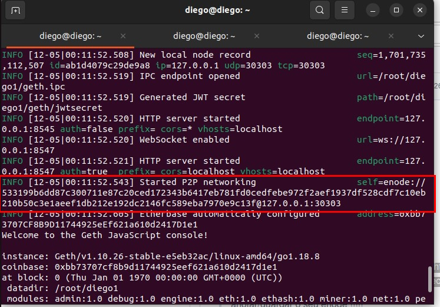

# Verificando Saldos
Vamos verificar agora o saldo inicial das 3 contas.
1. Execute `eth.getBalance("CHAVE_PUBLICA")
> Execute o comando `1.` três vezes, substituindo em cada vez, a chave pública de cada usuário criado.
Você pode fazer isso nos 3 terminais separados ou apenas em 1.

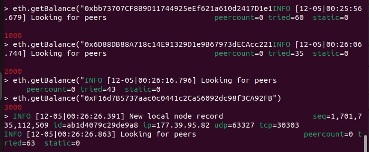

# Adicionando peers
Nas redes ethereums, os nós precisam conhecer os demais "pares" que estão executando na rede. Em redes públicas, esse processo acontece de forma automática e de uma forma bastante eficiente e não precisariámos nos preocupar quanto a isso. Porém, em redes privadas e de teste, como é o nosso caso, esse processo pode demorar um pouco mais. Faremos isso de maneira manual:
1. No usuário 1 (terminal), execute:
```
admin.addPeer("enode do usuário 2")
admin.addPeer("enode do usuário 3")
```

2. No usuário 2 (terminal), execute
```
admin.addPeer("enode do usuário 3")
```
Não precisamos fazer isso para cada enode, para todos os usuários, pois quando um par se conecta ao outro, eles automaticamente já se reconhecem (em ambos os "sentidos").
> O formato do enode será parecido com: `enode://<enode_id>@<ip_address>:<port>`

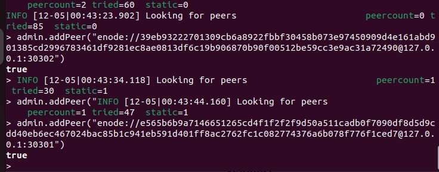

Você deverá receber a resposta "true" caso tudo tenha ocorrido com sucesso.

# Minerando
Agora vamos começar um processo de mineração em cada usuário.
1. Em cada terminal (usuário), execute: `miner.start(X)`
O valor de X é um número inteiro que indica a quantidade de threads que devem serem utilizadas para a mineração. Exemplo: `miner.start(5)`. No meu caso, utilizei apenas uma thread para cada usuário.

Em um primeiro momento, cada usuário passará por um processo de geração de "DAG", que consiste em um mecanismo de consenso utilizado na rede Ethereum, mais especificadamente, um algoritmo de mineração chamado "Ethash", que é um algoritmo de prova de trabalho.
O DAG (Directed Acyclic Graph) nada mais é do que um conjunto de dados necessários para resolver os desafios computacionais propostos pelo Etash. Isso torna a mineração mais efetiva e justa, sendo também uma camada adicional de segurança para o Ethereum.
Esse processo pode demorar um longo tempo, dependendo do seu hardware e da quantidade de threads utilizadas.

Quando a mineração de fato começar, você começará a ver algo semelhante a imagem abaixo em seu console:

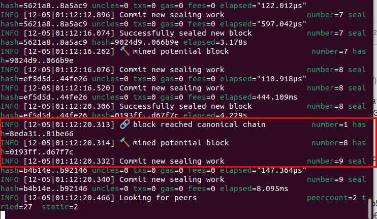

Deixe um tempo minerando e após, execute `miner.stop()` para parar a mineração.
> Neste momento, se você desejar, você pode verificar novamente o saldo de cada conta de usuário.

# Realizando transações
Vamos agora realizar transações entre as contas.
1. O primeiro passo, é desbloquear cada conta. Faça isso executando `personal.unlockAccount("CHAVE_PUBLICA")`. Realize esse processo para os 3 usuários.
> Realize individualmente em cada terminal de cada usuário. A senha do usuário será necessária nesta etapa.
Esse desbloqueio é necessário para "abrir a sua carteira Ethereum" e permitir que você faça transações. Esse desbloqueio é temporário, caso você demorar para executar os comandos seguintes, pode ser que seja necessário desbloquear a sua conta novamente.
2. Agora, para realizar uma transação, execute: `eth.sendTransaction({from:"CHAVE_PUBLICA_ORIGEM", to:"CHAVE_PUBLICA_DESTINO", value:VALOR, gas:GAS})`. Exemplo: `eth.sendTransaction({from:"0xe3CcD77ABc1b4Db5dC40E793C881e80273E29310", to:"0x51404Da1a1dA4D04534Ad85a1bE4e10f326e63B3", value:1111, gas:21000})`
```
Algumas considerações:

- VALUE: o valor em Ethereum que deseja transferir
- GAS: taxa que deve ser paga para processar a transação, que está ligado diretamente ao custo computacional que será necessário para esse processo. Isso ajuda a evitar abusos e ataques a rede Ethereum, bem como torná-la sustentável, já que cada transação terá um custo que deverá "cobrir" os consumo dos recursos necessários para efetivar uma transação. O valor de GAS mínimo é definido no arquivo genesis.json e nenhuma transação pode ser feita com valor abaixo dele
```

# Transação da 1º para a 2º conta
Realizaremos agora uma transação da primeira para a segunda conta, no valor de 111 Ethers.

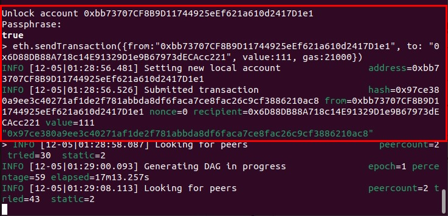

# Transação da 2º para a 3º conta
Realizaremos agora uma transação da segunda para a terceira conta, no valor de 222 Ethers.

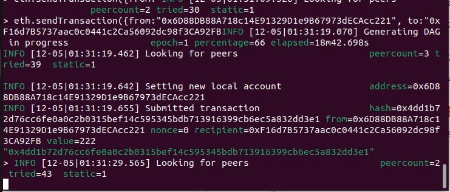

# Verificando pool de transações
Execute o comando `txpool.status`. Você deverá ver algo como abaixo:

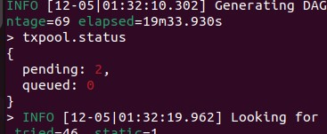

Observe que há duas transações pendentes, que são exatamente as duas transações que acabamos de fazer. Mas o que isso quer dizer? 
As transações, para serem concretizadas, precisam passar por um novo processo de mineração após serem feitas, pois, somente assim, elas serão incluídas em um novo bloco da blockchain (que vai conter todas as transações feitas naquele período). Isto é o que faz com que cada bloco da blockchain seja formado.

Então, para concretizar as suas transações, coloque uma das contas minerar novamente com `miner.start(5)`

Após um bloco ser encontrado e minerado, pare a mineração e execute novamente o comando `txpool.status`, você verá que não há mais nenhuma transação pendente.

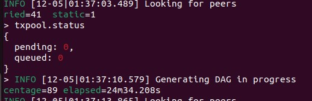

# Verificando novamente os saldos
Vamos verificar novamente como ficaram os saldos das 3 contas, após os processos de mineração e de transações.

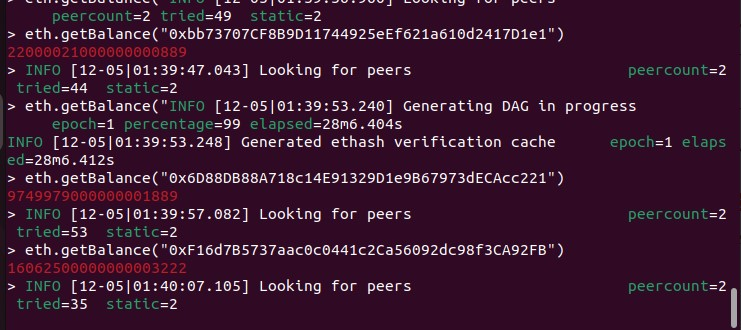

> Os saldos (em vermelho) estão em ordem de conta (da primeira para a terceira), respectivamente.

# Novidades em relação aos exemplos da aula
Como novidade deste trabalho, iremos instalar o `ethstats` para monitorar a nossa rede através de um dashboard. Como estamos utilizando uma imagem docker baseada no "Alpine", no lugar de "apt install", devemos utilizar "apk add ..."
> Importante: Para utilizar visualizar o dashboard do ethstats, vamos estar utilizado a porta 3000, para isso, precisei iniciar um novo container com `docker run` passando o parâmetro adicional `-p 3000:3000` (caso você criou o container no passo "Criando Container", não precisará fazer isso, pois lá esta porta já está configurada). Os próximos passos são executados dentro do container.
1. Executar `apk add nodejs`
2. Executar `apk add npm`
3. Executar `apk add git`
4. Executar `cd ~`
5. Executar `git clone https://github.com/cubedro/eth-netstats`
6. Executar `cd eth-netstats`
7. Executar `npm install` e esperar finalizar
8. Executar `npm install -g grunt-cli` e esperar finalizar
9. Executar `grunt`. Deverá receber uma mensagem "Done, without errors"
10. Executar `cd ..`
11. Executar `git clone https://github.com/cubedro/eth-net-intelligence-api`
12. Executar `cd eth-net-intelligence-api`
13. Executar `npm install`
14. Executar `npm install -g pm2`
15. Executar `cat app.json`
Das diversas propriedades presentes nesse arquivo, vamos alterar 3: `INSTANCE_NAME`, `WS_SERVER`, `WS_SECRET`
16. Executar `apk add nano`
17. Executar `nano app.json`
18. Alterar os valores para os dados abaixo:
```
INSTANCE_NAME="eth-stats" //Esse nome você pode escolher
WS_SERVER="http:localhost:3000"
WS_SECRET="mysecret"
```
19. Salve o arquivo
20. Executar `pm2 start app.json`
21. Executar `cd ~/eth-netstats`
22. Executar `pm2 restart node-app`
23. Executar `export WS_SECRET=mysecret && npm start`
24. Abra o navegador e pesquise pelo endereço `http://localhost:3000`. Você deverá ver a seguinte tela:

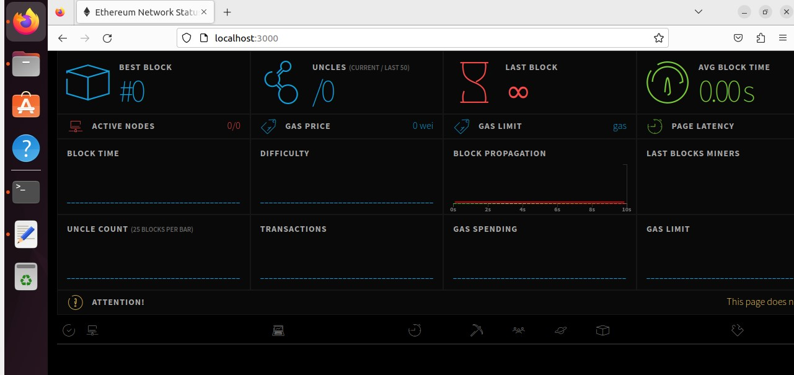

> Caso não carregar nada ao pesquisar no navegador, pare o processo do passo 23 com "CTRL + C", execute `pm2 restart node-app` novamente e execute novamente o comando do passo 23.

25. Faça algumas minerações e transações e verifique as mudanças no dashboard do ethstats.
> Pode ser necessário atualizar a página para as informações atualizarem

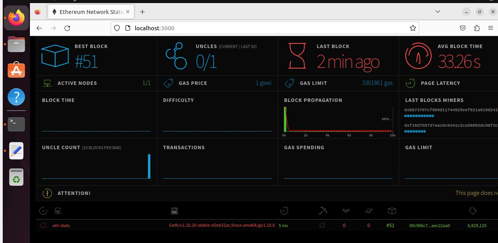

> Na imagem anterior, está aparecendo apenas um nó ativo, pois quando precisei reiniciar o container para aplicar a porta 3000 também, não levantei todos os nós na rede.

# Git
1. git add

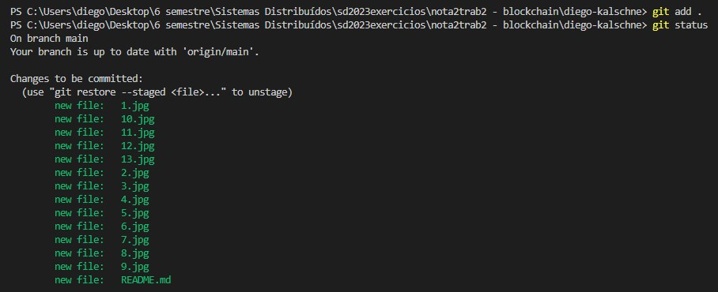

2. git commit

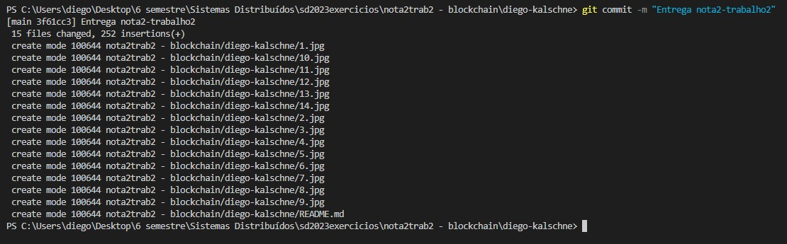

3. git push

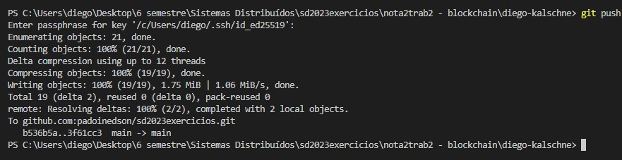