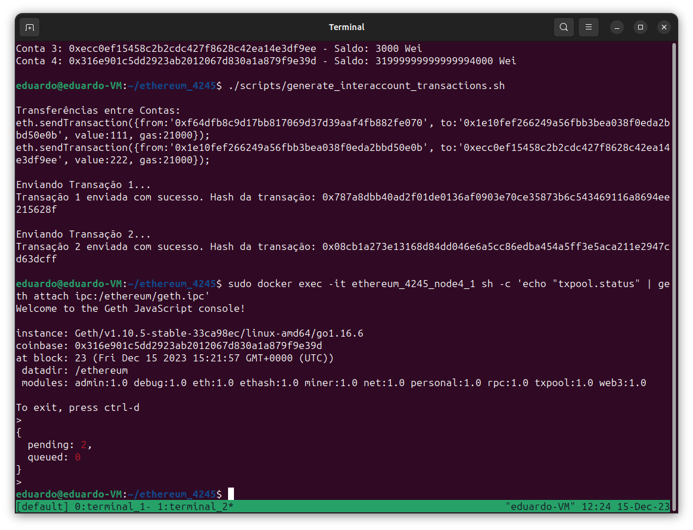

## Eduardo Fockink Silva - Dezembro de 2023

### Sumário

1. [Preparação do Ambiente de Trabalho](#preparação-do-ambiente-de-trabalho) 
2. [Execução](#execução)
    - Iniciar a Rede Ethereum
    - Verificar Saldo das Contas
    - Gerar Gas Inicial
    - Transações Iniciais
    - Efetivar Transações Iniciais
    - Gerar Gas para Contas
    - Transferências entre Contas
    - Parando a Rede
3. [Novidades em Relação ao Exemplo de Aula](#novidades-em-relaçãao-ao-exemplo-de-aula)
4. [Adicionando ao repositório remoto](#adicionando-ao-repositório-remoto)

### Preparação do Ambiente de Trabalho

Este guia descreve os passos para configurar um ambiente Ethereum para testes e desenvolvimento.

Há duas opções para seguir este tutorial:

1. **Baixar a Pasta do Repositório:**
É recomendado baixar a pasta do repositório com os arquivos prontos.
    
    ```bash
    mv ethereum_4245 $HOME/
    ```
    
    Após baixar, prossiga para a execução.
    
2. **Criar Scripts Manualmente:**
Caso queira criar todos os arquivos manualmente, acesse o arquivo [scripts](./Scripts.md) e siga todos os passos. Após criar os arquivos, volte para a execução.

---

### Execução

Navegue até o diretório **`$HOME/ethereum_4245/`**.

```bash
cd $HOME/ethereum_4245/
```

1. **Iniciar a Rede Ethereum:**
Use o **`docker-compose`** para construir e iniciar os serviços.
    
    ```bash
    sudo docker-compose up --build
    ```
    
    Esse terminal (terminal 1) ficara conectado aos logs dos node para acompanharmos os mesmos. 
    
2. **Verificar Saldo das Contas:**
Após iniciar a rede, abra outra instância do terminal (terminal 2) e verifique o saldo das contas.
    
    ```bash
    cd $HOME/ethereum_4245/
    ./scripts/get_balance.sh
    ```
    
    Todas as contas estão zeradas, precisamos minerar para gerar gas.
    

    **Print 1 da criação das contas**
    

    
3. **Gerar Gas Inicial:**
Use o node4 para iniciar a mineração da blockchain.
    
    ```bash
    sudo docker exec -it ethereum_4245_node4_1 sh -c 'echo "miner.start(1)" | geth attach ipc:/ethereum/geth.ipc'
    ```
    
    Podemos voltar para o terminal 1  para acompanharmos a geração do primeiro bloco, depois de concluído podemos voltar para o terminal 2 e conferir o saldo. Quando tiver gas podemos parar o node.
    
    ```bash
    ./scripts/get_balance.sh
    ```
    
    ```bash
    sudo docker exec -it ethereum_4245_node4_1 sh -c 'echo "miner.stop()" | geth attach ipc:/ethereum/geth.ipc'
    ```
    
4. **Transações Iniciais:**
    
    Use o script que automatiza o envio das transações para as contas.
    
    ```bash
    ./scripts/generate_initial_transactions.sh
    ```
    
    Verifique se as transações foram para o pool e que os saldos ainda não foram efetivados:
    
    ```bash
    sudo docker exec -it ethereum_4245_node4_1 sh -c 'echo "txpool.status" | geth attach ipc:/ethereum/geth.ipc'
    ```
    
    ```bash
    ./scripts/get_balance.sh
    ```
    
5. **Efetivar Transações Iniciais:**
    
    Minere o bloco usando o node4 para efetivar as transações.
    
    ```bash
    sudo docker exec -it ethereum_4245_node4_1 sh -c 'echo "miner.start(1)" | geth attach ipc:/ethereum/geth.ipc'
    ```
    
    Volte para o terminal 1 e confira a mineração do bloco. Quando o saldo das contas estiver atualizado pare o minerador e confira o pool vazio.
    
    ```bash
    ./scripts/get_balance.sh
    ```

    **Print 2 dos saldos das contas**
    

    **Print 3 da mineração**
    
    

    ```bash
    sudo docker exec -it ethereum_4245_node4_1 sh -c 'echo "miner.stop()" | geth attach ipc:/ethereum/geth.ipc'
    ```
    
    ```bash
    sudo docker exec -it ethereum_4245_node4_1 sh -c 'echo "txpool.status" | geth attach ipc:/ethereum/geth.ipc'
    ```
    
6. **Gerar Gas para Contas:**
    
    Para realizar as transações entre as contas é preciso saldo para pagar o gas. Minere com os nodes 1 e 2 para gerar saldo suficiente para pagar o gas das transações.
    
    ```bash
    sudo docker exec -it ethereum_4245_node1_1 sh -c 'echo "miner.start(1)" | geth attach ipc:/ethereum/geth.ipc'
    ```
    
    Espere 1 minuto
    
    ```bash
    sudo docker exec -it ethereum_4245_node1_1 sh -c 'echo "miner.stop()" | geth attach ipc:/ethereum/geth.ipc'
    ```
    
    ```bash
    sudo docker exec -it ethereum_4245_node2_1 sh -c 'echo "miner.start(1)" | geth attach ipc:/ethereum/geth.ipc'
    ```
    
    Espere 1 minuto
    
    ```bash
    sudo docker exec -it ethereum_4245_node2_1 sh -c 'echo "miner.stop()" | geth attach ipc:/ethereum/geth.ipc'
    ```
    
    ```bash
    ./scripts/get_balance.sh
    ```
    
    Rodamos os nodes individualmente pois rodar os nodes simultaneamente pode gerar sobrecarga na máquina. É possivel executar e parar os 4 nodes ao mesmo tempo usando os seguintes scripts.
    
    ```bash
    ./scripts/mine_start.sh
    ```
    
    ```bash
    ./scripts/mine_stop.sh
    ```
    
7. **Transferências entre Contas:**
    
    Use o script que automatiza o envio das duas transações. Verifique o pool e o saldo, então  inicie o minerador.
    
    ```bash
    ./scripts/generate_interaccount_transactions.sh
    ```
    
    ```bash
    sudo docker exec -it ethereum_4245_node4_1 sh -c 'echo "txpool.status" | geth attach ipc:/ethereum/geth.ipc'
    ```
    
    ```bash
    ./scripts/get_balance.sh
    ```
    
    ```bash
    sudo docker exec -it ethereum_4245_node4_1 sh -c 'echo "miner.start(1)" | geth attach ipc:/ethereum/geth.ipc'
    ```
    
    **Print 4 das transações**
    
    
    Confira se os saldos foram atualizados, se sim pare para o minerador.
    
    ```bash
    ./scripts/get_balance.sh
    ```
    
    ```bash
    sudo docker exec -it ethereum_4245_node4_1 sh -c 'echo "miner.stop()" | geth attach ipc:/ethereum/geth.ipc'
    ```
    
    **Print 5 dos saldos finais**
    
    
    Pronto, subimos a rede ethereum utilizando o docker compose, geramos gas para fazer as transações iniciais, realizamos elas, então geramos gas para fazer as transações entre as contas e também realizamos essas.
    
8. **Parando a rede:**
    
    ```bash
    sudo docker-compose down
    ```
    
    ### Novidades em relaçãao ao exemplo de aula
    
    Muitas mudanças foram feitas em relação ao exemplo da aula, as pricipais são:
    
    1. **Uso de Nodes em Contêineres Separados:** Melhora a modularidade e isolação de cada componente da rede, permitindo uma gestão e manutenção mais eficientes.
    2. **Descoberta Automática de Peers com Bootnode:** Facilita a conexão e comunicação entre os nodes, otimizando a formação da rede.
    3. **Inicialização dos Nodes via Scripts:** Proporciona uma abordagem automatizada e consistente para inicializar os nodes, aumentando a eficiência e reduzindo erros manuais.
    4. **Início da Rede com Docker-Compose:** Centraliza e simplifica o processo de levantar toda a infraestrutura da rede com um único comando.
    5. **Uso do Protocolo IPC para Maior Segurança:** Oferece uma comunicação mais segura entre os processos, melhorando a integridade e confidencialidade da rede.
    6. **Criação e Liberação Automática de Contas:** Automatiza o processo de criação de contas Ethereum, tornando o setup inicial mais rápido e menos propenso a erros.
    7. **Transações Automatizadas via Scripts:** Agiliza a execução de transações, permitindo testes e operações de rede mais eficientes e controladas.
    
## Adicionando ao repositório remoto

**Print 6 git add**


**Print 7 git commit**


**Print 8 git push**
