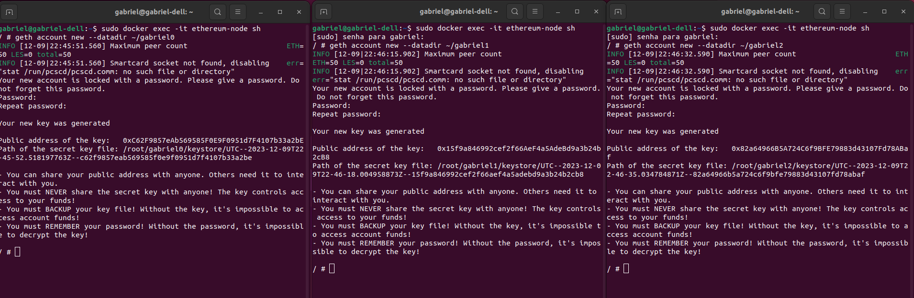
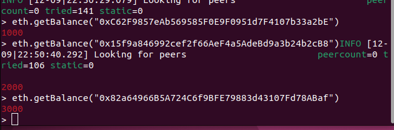
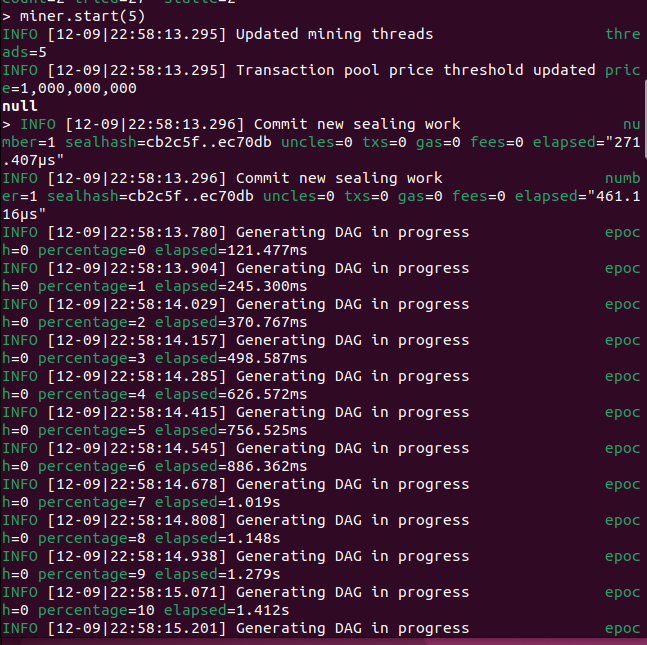
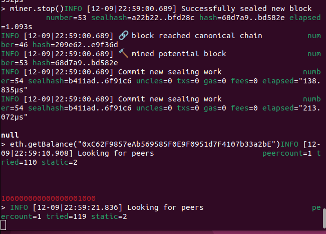
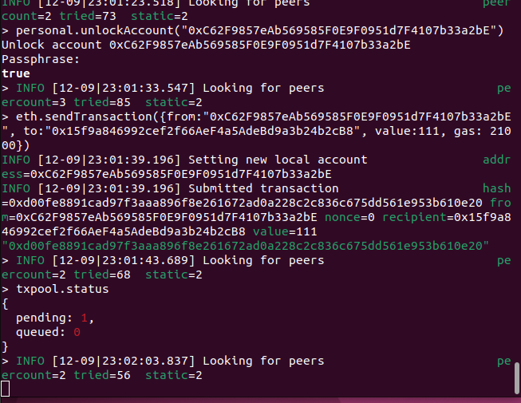
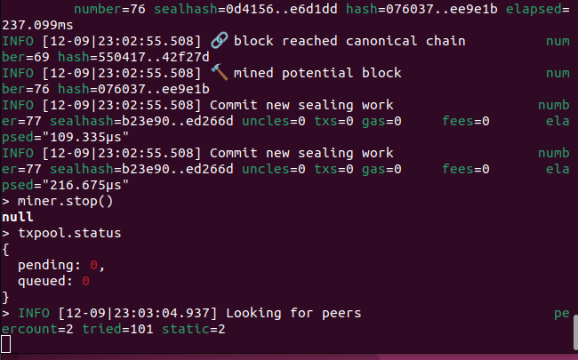
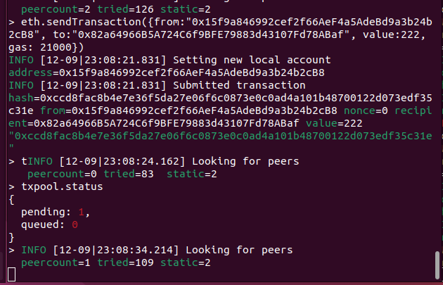
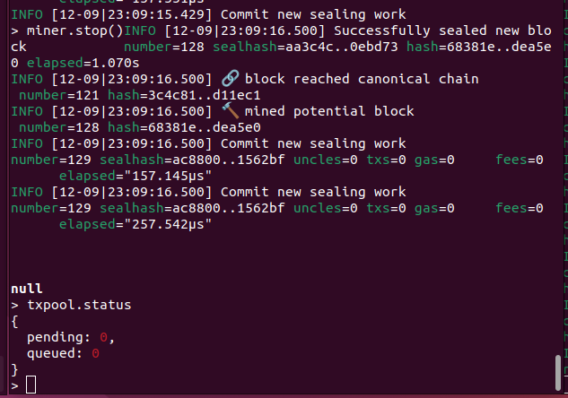
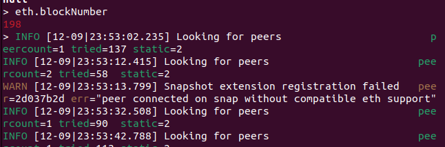
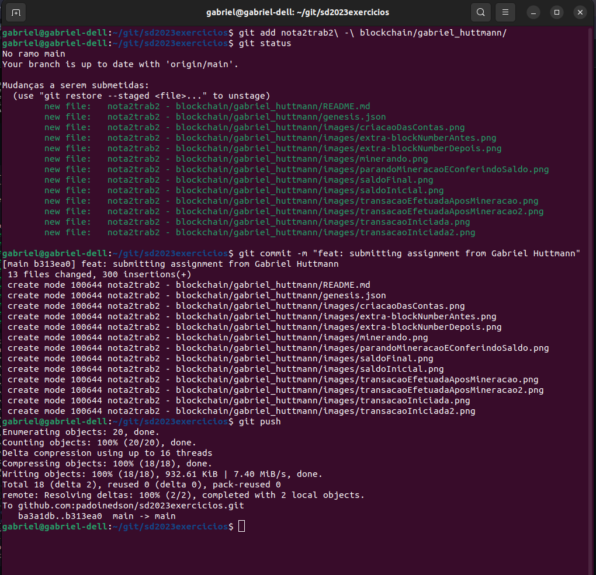

Aluno: Gabriel Pires Huttmann

### Será necessário docker
Para instalar:
```
sudo apt install docker
sudo apt install docker.io
```

# Blockchain

primeiro passo é criar uma pasta para os dados da blockchain
```
mkdir ethereum
```
dentro desta pasta criar um arquivo chamado genesis.json, no qual será configurada a blockchain
```
nano ethereum/genesis.json
```
dentro deste arquivo escrever
```
{
    "config": {
        "chainId": 2023,
        "homesteadBlock": 0,
        "eip150Block": 0,
        "eip155Block": 0,
        "eip158Block": 0,
        "byzantiumBlock": 0,
        "constantinopleBlock": 0,
        "petersburgBlock": 0,
        "istanbulBlock": 0
    },
    "alloc": {
    },
    "coinbase": "0x0000000000000000000000000000000000000000",
    "difficulty": "0x20000",
    "extraData": "",
    "gasLimit": "0x2fefd8",
    "nonce": "0x0000000000000111",
    "mixhash": "0x0000000000000000000000000000000000000000000000000000000000000000",
    "parentHash": "0x0000000000000000000000000000000000000000000000000000000000000000",
    "timestamp": "0x00"
}
```

vamos utilizar a imagem ethereum/client-go para o docker, na versão release-1.10, para baixa-la
```
sudo docker pull ethereum/client-go:release-1.10
```

para rodar o container (rodando em background, utilizando volume e conectando portas do host com as do container)
```
sudo docker run -d --name ethereum-node -v $HOME/ethereum:/root -p 8545:8545 -p 8544:8544 -p 30301:30301 -p 30302:30302 -it --entrypoint=/bin/sh ethereum/client-go:release-1.10
```

para entrar no container agora executando
```
sudo docker exec -it ethereum-node sh
```
criar a primeira conta
```
geth account new --datadir ~/gabriel0
```
salvar chave pública `0xC62F9857eAb569585F0E9F0951d7F4107b33a2bE`


abrir um segundo terminal no qual será criado a segunda conta, acessar o container
```
sudo docker exec -it ethereum-node sh
```
criar a segunda conta
```
geth account new --datadir ~/gabriel1
```
salvar chave pública `0x15f9a846992cef2f66AeF4a5AdeBd9a3b24b2cB8`


abrir um terceiro terminal no qual será criado a terceira conta, acessar o container
```
sudo docker exec -it ethereum-node sh
```
criar a terceira conta
```
geth account new --datadir ~/gabriel2
```
salvar chave pública `0x82a64966B5A724C6f9BFE79883d43107Fd78ABaf`

> print da criação das contas



atualizar no genesis.json as chaves públicas com as contas no alloc (para as contas terem um saldo inicial)
genesis.json passa a ser assim:
```
{
    "config": {
        "chainId": 2023,
        "homesteadBlock": 0,
        "eip150Block": 0,
        "eip155Block": 0,
        "eip158Block": 0,
        "byzantiumBlock": 0,
        "constantinopleBlock": 0,
        "petersburgBlock": 0,
        "istanbulBlock": 0
    },
    "alloc": {
   	   "0xC62F9857eAb569585F0E9F0951d7F4107b33a2bE": {
   	 	"balance": "1000"
   	   },
   	   "0x15f9a846992cef2f66AeF4a5AdeBd9a3b24b2cB8": {
   	 	"balance": "2000"
   	   },
   	   "0x82a64966B5A724C6f9BFE79883d43107Fd78ABaf": {
   	 	"balance": "3000"
   	   }
    },
    "coinbase": "0x0000000000000000000000000000000000000000",
    "difficulty": "0x20000",
    "extraData": "",
    "gasLimit": "0x2fefd8",
    "nonce": "0x0000000000000111",
    "mixhash": "0x0000000000000000000000000000000000000000000000000000000000000000",
    "parentHash": "0x0000000000000000000000000000000000000000000000000000000000000000",
    "timestamp": "0x00"
}
```


iniciar os nós na rede (atualizando com o genesis.json)
> no primeiro terminal
```
cd /root
geth --datadir /root/gabriel0/ init genesis.json
```

> no segundo terminal
```
cd /root
geth --datadir /root/gabriel1/ init genesis.json
```

> no terceiro terminal
```
cd /root
geth --datadir /root/gabriel2/ init genesis.json
```


executar o nó na rede no primeiro terminal 
```
geth --datadir ~/gabriel0 --networkid 2023 --http --http.api 'txpool,eth,net,web3,personal,admin,miner' --http.corsdomain '*' --authrpc.port 8547 --allow-insecure-unlock console
```
salvar enode `enode://4ce35e0dbff90651bc629c6580e41b2f7f105963f84e9a18339d1d9db8ea3c591505298ff0e64987bcc13a7f9c66a02094b2658af422c289cda3feb51483e0a3@127.0.0.1:30303`

executar o nó na rede no segundo terminal
```
geth --datadir ~/gabriel1 --networkid 2023 --http --http.api 'txpool,eth,net,web3,personal,admin,miner' --http.corsdomain '*' --authrpc.port 8546 --port 30302 --http.port 8544 --allow-insecure-unlock console
```
salvar enode `enode://6e10f3b7d45285617e9be87b9889520ff417c87f1750655caf8befcab293fcbda6de9ebadc0c2b0b54c58d22c63daf19d8f72f03694bde8607bd074ce6045de5@127.0.0.1:30302`

executar o nó na rede no terceiro terminal
```
geth --datadir ~/gabriel2 --networkid 2023 --http --http.api 'txpool,eth,net,web3,personal,admin,miner' --http.corsdomain '*' --authrpc.port 8549 --port 30304 --http.port 8548 --allow-insecure-unlock console
```
salvar enode `enode://05366aff0f2961a74321e0e343e5fd70ad975a710a676740eece15d0bd87326bd9aabd5c5a99106ec53aba6fab044e2d3e65f16bcaebbda6ffb92465dc65ab20@127.0.0.1:30304`


checar saldo inicial
```
eth.getBalance("0xC62F9857eAb569585F0E9F0951d7F4107b33a2bE")
eth.getBalance("0x15f9a846992cef2f66AeF4a5AdeBd9a3b24b2cB8")
eth.getBalance("0x82a64966B5A724C6f9BFE79883d43107Fd78ABaf")
```


conectar os peers
> no primeiro terminal
```
admin.addPeer("enode://6e10f3b7d45285617e9be87b9889520ff417c87f1750655caf8befcab293fcbda6de9ebadc0c2b0b54c58d22c63daf19d8f72f03694bde8607bd074ce6045de5@127.0.0.1:30302");
admin.addPeer("enode://05366aff0f2961a74321e0e343e5fd70ad975a710a676740eece15d0bd87326bd9aabd5c5a99106ec53aba6fab044e2d3e65f16bcaebbda6ffb92465dc65ab20@127.0.0.1:30304");
```

> no segundo terminal
```
admin.addPeer("enode://4ce35e0dbff90651bc629c6580e41b2f7f105963f84e9a18339d1d9db8ea3c591505298ff0e64987bcc13a7f9c66a02094b2658af422c289cda3feb51483e0a3@127.0.0.1:30303");
admin.addPeer("enode://05366aff0f2961a74321e0e343e5fd70ad975a710a676740eece15d0bd87326bd9aabd5c5a99106ec53aba6fab044e2d3e65f16bcaebbda6ffb92465dc65ab20@127.0.0.1:30304");
```

> no terceiro terminal
```
admin.addPeer("enode://4ce35e0dbff90651bc629c6580e41b2f7f105963f84e9a18339d1d9db8ea3c591505298ff0e64987bcc13a7f9c66a02094b2658af422c289cda3feb51483e0a3@127.0.0.1:30303");
admin.addPeer("enode://6e10f3b7d45285617e9be87b9889520ff417c87f1750655caf8befcab293fcbda6de9ebadc0c2b0b54c58d22c63daf19d8f72f03694bde8607bd074ce6045de5@127.0.0.1:30302");
```

mineirar
```
miner.start(5)
```


para parar a mineração
```
miner.stop()
```
checar saldo
```
eth.getBalance("0xd4843924A2eBEBe28921b8c194121e00fe1c2442")
```


### transações 
#### do cliente 1 para o 2
para desbloquear a conta do cliente 1
```
personal.unlockAccount("0xC62F9857eAb569585F0E9F0951d7F4107b33a2bE")
```

transação do cliente 1 para o cliente 2
```
eth.sendTransaction({from:"0xC62F9857eAb569585F0E9F0951d7F4107b33a2bE", to:"0x15f9a846992cef2f66AeF4a5AdeBd9a3b24b2cB8", value:111, gas: 21000})
```
> transação iniciada


> transação efetuada (após minerar para a transação ser libeirada)


#### do cliente 2 para o 3
para desbloquear a conta do cliente 2
```
personal.unlockAccount("0x15f9a846992cef2f66AeF4a5AdeBd9a3b24b2cB8")
```

transação do cliente 2 para o cliente 3 `(mineirar antes para ter saldo o suficiente para o value + gas)`
```
eth.sendTransaction({from:"0x15f9a846992cef2f66AeF4a5AdeBd9a3b24b2cB8", to:"0x82a64966B5A724C6f9BFE79883d43107Fd78ABaf", value:222, gas: 21000})
```
> transação iniciada


> transação efetuada(após minerar para a transação ser libeirada)


#### saldo final


> parar o container
```
sudo docker stop ethereum-node
```

### novidades
é possível ver em qual bloco a blockchain se encontra com o comando:
```
eth.blockNumber
```
> block number


> block number depois de minerar um pouco


### print do git
