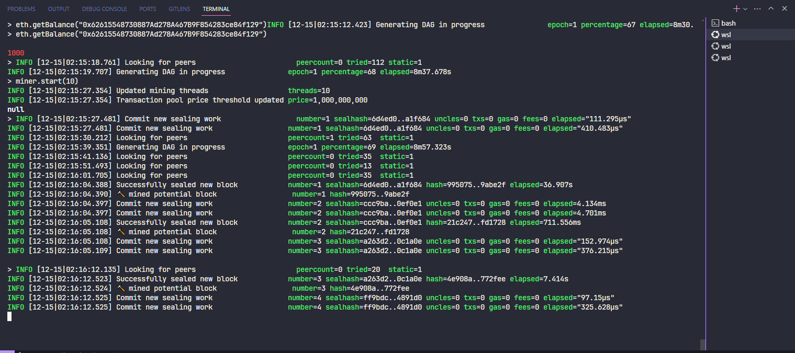

# Blockchain - João Victor Martins

# Sistema utilizado: WSL (Ubuntu no Windows)

Este guia fornece instruções detalhadas para configurar uma rede Blockchain Ethereum usando o Docker e o cliente Geth. A rede privada permitirá criar contas, minerar Ether e realizar transações em uma rede isolada.

## Pré-requisitos

Certifique-se de que você tenha o Docker instalado em seu sistema. Você pode instalar o Docker seguindo as [instruções oficiais](https://docs.docker.com/get-docker/).

## Passos

### 1. Pull da Imagem Docker Ethereum

Execute o seguinte comando para baixar a imagem Docker Ethereum:

```bash
docker pull ethereum/client-go:release-1.10
```

### 2. Crie um Diretório para o Genesis Block

```bash
mkdir ethereum
cd ethereum
```

### 3. Crie um Arquivo genesis.json

```bash
{
   "config":{
      "chainId":2023,
      "homesteadBlock":0,
      "eip150Block":0,
      "eip155Block":0,
      "eip158Block":0,
      "byzantiumBlock":0,
      "constantinopleBlock":0,
      "petersburgBlock":0,
      "istanbulBlock":0
   },
   "alloc":{
      "":{
         "balance":"1000"
      },
      "":{
         "balance":"2000"
      },
      "":{
         "balance":"3000"
      }
   },
   "coinbase":"0x0000000000000000000000000000000000000000",
   "difficulty":"0x20000",
   "extraData":"",
   "gasLimit":"0x2fefd8",
   "nonce":"0x0000000000000111",
   "mixhash":"0x0000000000000000000000000000000000000000000000000000000000000000",
   "parentHash":"0x0000000000000000000000000000000000000000000000000000000000000000",
   "timestamp":"0x00"
}
```

### 4. Crie um Contêiner Docker Ethereum
```bash
docker run -d --name ethereum -v $(pwd)/ethereum:/root -p 8545:8545 -p 8544:8544 -p 30301:30301 -p 30302:30302 -p 3000:3000 -it --entrypoint=/bin/sh ethereum/client-go:release-1.10
```

### 5. Crie Contas Ethereum
Acesse o contêiner que você criou anteriormente:
```bash
docker exec -it ethereum-node sh
```

Dentro dos contêineres, crie contas Ethereum para os usuários. Substitua [NOME] por nomes únicos para cada usuário. No nosso caso iremos criar 3 contas, denominadas **conta1, conta2 e conta3**:

```bash
geth account new --datadir ~/[NOME]
```

*Conta1 - hash: 0x62615548730887Ad278A467B9F854283ce84f129*


*Conta2 - hash: 0x1573Ef4Cb1CBaD84e286Dbf5e9EB7C13CA58428A*


*Conta3 - hash: 0x7Ef2c8b2468E2def6800da4156e359B512B1EC53*


**Será solicitada a criação de uma senha para cada conta. Anote as senhas e copie as chaves públicas exibidas no console.**

### 6. Associe as Chaves Públicas às Contas
Dentro do contêiner, abra o arquivo genesis.json:

```bash
nano /root/ethereum/genesis.json
```
Substitua os campos alloc pelas chaves públicas das contas criadas, associando cada conta a um nome (por exemplo, conta1, conta2, conta3) e salve o arquivo. Salve também o `hash` de cada conta para utilizar no arquivo genesis.json, e preencha `qual será o saldo inicial` como foi feito abaixo:

```json
...
  "alloc": {
    "0x62615548730887Ad278A467B9F854283ce84f129": {
      "balance": "1000"
    },
    "0x1573Ef4Cb1CBaD84e286Dbf5e9EB7C13CA58428A": {
      "balance": "2000"
    },
    "0x7Ef2c8b2468E2def6800da4156e359B512B1EC53": {
      "balance": "3000"
    }
  },
...
```

Após substituir, confira se o saldo das contas foi configurado executando o comando: 
```bash
eth.getBalance("HASH_CONTA_1")
eth.getBalance("HASH_CONTA_2")
eth.getBalance("HASH_CONTA_3")
```

Altere a variável `HASH_CONTA_*` pelo hash das 3 contas geradas

Saldo inicial de todas as contas


### 7. Inicialize os Nós da Rede
Dentro do contêiner, vá para o diretório /root e inicialize os nós da rede Ethereum para cada usuário. Substitua [NOME] pelo nome de cada usuário. No nosso caso, vamos fazer esse passo 3 vezes (`conta1, conta2 e conta3`):

```bash
cd /root
geth --datadir ~/[NOME] init /root/ethereum/genesis.json
```

### 8. Inicie os Nós da Rede Ethereum
Dentro do contêiner, inicie os nós da rede Ethereum para cada usuário em terminais separados:

```bash
geth --datadir ~/[NOME] --networkid 2023 --http --http.api 'txpool,eth,net,web3,personal,admin,miner' --http.corsdomain '*' --authrpc.port 8547 --allow-insecure-unlock console

```

### 9. Minerando Ether
Em cada terminal de usuário, inicie a mineração com o seguinte comando, ajustando o valor de X para o número de threads desejado. No meu caso irei executar 10:

```javascript
// Terminal conta1
miner.start(X) // 10
```

`ATENÇÃO: Para o caso de testes e para que a documentação não fique muito extensa, apenas a conta1 será minerada e fará transação para a conta2.`

Mineração iniciada na conta1


A mineração começará após a criação do DAG. Aguarde até que a mineração comece de fato.

Após minerar o suficiente para fazer uma transação, utilize o o comando `miner.stop()` para interromper a mineração. Agora, verifique o saldo da sua conta executando o comando abaixo:


```bash
eth.getBalance("HASH_CONTA_1")
```

Saldo conta1 após minerar


### 10. Realize Transações
Para realizar transações entre contas, desbloqueie a conta de origem em cada terminal de usuário:


```bash
personal.unlockAccount("HASH_CONTA_1")
```

Unlock conta1


Se a conta foi desbloqueada com sucesso, o console irá retornar um `true`.

Substitua "HASH_CONTA_1" pela chave pública da conta que deseja desbloquear. Digite a senha quando solicitado.

Em seguida, envie uma transação usando o seguinte comando:

```bash
eth.sendTransaction({ from: "HASH_CONTA_1", to: "HASH_CONTA_2", value: VALOR, gas: GAS })
```
Substitua "HASH_CONTA_1" pela chave pública da conta de origem, "HASH_CONTA_1" pela chave pública da conta de destino, VALOR pelo valor a ser transferido em Ether e GAS pelo limite de gás para a transação.

Transação conta1 para conta2


Após enviar a transação, você deve minerar novamente executando o `Passo 9`. A partir do momento que você encerrar a mineração, valide se ela foi executada utilizando o comando abaixo:

```bash
txpool.status
```

Caso tudo tenha ocorrido sem erros, você poderá visualizar o saldo final entre as contas, executando o comando `eth.getBalance("HASH_CONTA_1") e eth.getBalance("HASH_CONTA_2")` como é demonstrado abaixo:


### 11. Novidades - 2 novos comandos!

#### 11.1. personal.newAccount

O comando `personal.newAccount` no Ethereum é usado para gerar uma nova chave privada e armazená-la no diretório de chave. O arquivo de chave é criptografado com a senha fornecida para aumentar a segurança. Esse comando retorna o endereço da nova conta Ethereum.

## Como Usar

### Usando o Console Geth

1. Inicie o seu console Geth.
2. Use o comando `personal.newAccount()` sem argumentos.

```javascript
> personal.newAccount()
Senha:
Repita a senha:
"0x5e97870f263700f46aa00d967821199b9bc5a120"
```

Quando você executa personal.newAccount() no console Geth, ele solicitará que você insira uma senha para a nova conta. Você deve fornecer a senha duas vezes para confirmação.

###  Usando RPC (JSON-RPC)
Você também pode usar o método personal_newAccount via JSON-RPC para criar uma nova conta. Aqui está um exemplo de solicitação RPC:

```javascript
{
  "method": "personal_newAccount",
  "params": ["sua_senha"]
}
```

Substitua "sua_senha" pela senha desejada para a nova conta.

A resposta conterá o endereço da conta recém-criada.

Fornecendo a Senha como String
Se você deseja especificar a senha diretamente ao criar a conta, sem o prompt interativo, pode fornecer a senha como um argumento. Por exemplo:

```javascript
> personal.newAccount("h4ck3r")
"0x3d80b31a78c30fc628f20b2c89d7ddbf6e53cedc"
```
Nesse caso, a conta é criada com a senha "h4ck3r" e o endereço é retornado imediatamente.

**Lembre-se de que a senha é crucial para a segurança da conta e deve ser mantida em sigilo. Perder a senha significa perder o acesso à conta e a quaisquer fundos associados a ela. Certifique-se de armazená-la com segurança e não compartilhá-la com ninguém.**


#### 11.2. personal.newAccount


O comando `eth_call` no Ethereum é usado para fazer chamadas de leitura em contratos inteligentes sem criar uma transação na blockchain. Isso permite que você consulte informações ou execute funções no contrato sem gastar Ether ou alterar o estado da blockchain.

## Como Usar

### Usando o Console Geth

1. Inicie o seu console Geth.
2. Use o comando `eth.call` com os seguintes argumentos:

   - O objeto de chamada, que inclui o endereço do contrato e os dados da função a ser chamada.
   - O bloco no qual você deseja realizar a chamada (opcional).

Aqui está um exemplo de como usar o `eth.call` no console Geth:

```javascript
> eth.call({
    to: "endereço_do_contrato",
    data: "0x12345678" // Dados da função a ser chamada
})
```

###  Usando RPC (JSON-RPC)
Você também pode usar o método eth_call via JSON-RPC para fazer chamadas de leitura em contratos inteligentes. Aqui está um exemplo de solicitação RPC:


```javascript

{
  "method": "eth_call",
  "params": [
    {
      "to": "endereço_do_contrato",
      "data": "0x12345678" // Dados da função a ser chamada
    },
    "latest" // Bloco no qual você deseja realizar a chamada (opcional)
  ]
}
```

**Observações**

- Lembre-se de que as chamadas de leitura não alteram o estado da blockchain e são gratuitas em termos de Ether.
- Os dados da função a serem passados em data devem ser codificados de acordo com a especificação do contrato inteligente.
- A especificação do contrato inteligente determinará o que você pode consultar e como interpretar os resultados.
- O eth_call é uma ferramenta útil para interagir com contratos inteligentes e obter informações sem a necessidade de criar transações na blockchain. Certifique-se de entender a especificação do contrato inteligente que você está consultando para usar esse comando efetivamente.