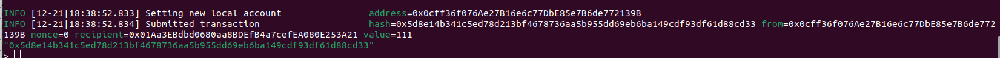

## Aplicação de Blockchain em aplicação real.

------------
### Aluno: Vinicius Krupp Fuhrmann

------------

###### - Demanda da utilização do Docker!

-> Atualize e faça o upgrade do sistema:
	sudo apt update
	sudo apt upgrade

-> Crie um diretório chamado ethereum:
	mkdir ethereum
	
-> Crie o arquivo genesis.json dentro da ethereum:
	nano genesis.json
	
Adicione o seguinte conteudo:
	{
	    "config": {
		"chainId": 2023,
		"homesteadBlock": 0,
		"eip150Block": 0,
		"eip155Block": 0,
		"eip158Block": 0,
		"byzantiumBlock": 0,
		"constantinopleBlock": 0,
		"petersburgBlock": 0,
		"istanbulBlock": 0
	    },
	    "alloc": {
		"0x90bA23C7A92C7d524E5B5cc9D6dA30D65Ba30944": {
		    "balance": "5000"
		},
		"0x90F8BE615B29B10B2E4B9BbF3ae17B970c86b955": {
		    "balance": "6000"
		}
	    },
	    "coinbase": "0x0000000000000000000000000000000000000000",
	    "difficulty": "0x20000",
	    "extraData": "",
	    "gasLimit": "0x2fefd8",
	    "nonce": "0x0000000000000111",
	    "mixhash": "0x0000000000000000000000000000000000000000000000000000000000000000",
	    "parentHash": "0x0000000000000000000000000000000000000000000000000000000000000000",
	    "timestamp": "0x00"
	}	
	

-> Baixe a imagem 'ethereum/client-go':
	sudo docker pull ethereum/client-go:release-1.10
	
-> Execute o container:
	sudo docker run -d --name ethereum-node -v $HOME/ethereum:/root -p 8545:8545 -p 8544:8544 -p 30301:30301 -p 30310:30310 -p 30320:30320 -p 		30330:30330 -it --entrypoint=/bin/sh ethereum/client-go:release-1.10

-> Abra mais 3 terminais para funcionarem como clientes:
-> Execute o docker dentro de cada um:
	sudo docker exec -it ethereum-node sh

-> Entre na root
	cd /root

-> Apos feito isso nos 3 clientes crie as contas em cada 1 dos 3:
	geth account new --datadir ~/(Substitua pelo nome desejado para a conta)

##### Contas Criadas e sua chave:

###### bebeto
0x0cff36f076Ae27B16e6c77DbE85e7B6de772139B

reinaldo
0x01Aa3EBdbd0680aa8BDEfB4a7cefEA080E253A21

moises
0x1c3B9cfc1BC31069528cA42Ebfcf17C048ce82e9

-> Com a chave pública de cada um atualize o arquivo genesis.json

	{
	    "config": {
		"chainId": 2023,
		"homesteadBlock": 0,
		"eip150Block": 0,
		"eip155Block": 0,
		"eip158Block": 0,
		"byzantiumBlock": 0,
		"constantinopleBlock": 0,
		"petersburgBlock": 0,
		"istanbulBlock": 0
	    },
	    "alloc": {
		"0x0cff36f076Ae27B16e6c77DbE85e7B6de772139B": {
		    "balance": "1000"
		},
		"0x01Aa3EBdbd0680aa8BDEfB4a7cefEA080E253A21": {
		    "balance": "2000"
		},
		"0x1c3B9cfc1BC31069528cA42Ebfcf17C048ce82e9": {
		    "balance": "3000"
		}
	    },
	    "coinbase": "0x0000000000000000000000000000000000000000",
	    "difficulty": "0x20000",
	    "extraData": "",
	    "gasLimit": "0x2fefd8",
	    "nonce": "0x0000000000000111",
	    "mixhash": "0x0000000000000000000000000000000000000000000000000000000000000000",
	    "parentHash": "0x0000000000000000000000000000000000000000000000000000000000000000",
	    "timestamp": "0x00"
	}
	
-> Iniciar Nos de Rede em cada terminal de cliente:
	geth --datadir /root/(Substitua pelo nome de cada cliente)/ init genesis.json

-> Nos terminais respectivos para cada cliente, execute:
	
	geth --datadir ~/bebeto --networkid 2023 --http --http.api 'txpool,eth,net,web3,personal,admin,miner' --http.corsdomain '*' --authrpc.port 8547 --allow-insecure-unlock console
	
	geth --datadir ~/reinaldo --networkid 2023 --http --http.api 'txpool,eth,net,web3,personal,admin,miner' --http.corsdomain '*' --authrpc.port 8546 --port 30302 --http.port 8544 --allow-insecure-unlock console
	
	geth --datadir ~/moises --networkid 2023 --http --http.api 'txpool,eth,net,web3,personal,admin,miner' --http.corsdomain '*' --authrpc.port 8548 --port 30500 --http.port 30501 --allow-insecure-unlock console
	
-> Verifique o saldo das contas:
	eth.getBalance("Chave da conta")

-> Inicie a mineração:
	miner.start(10)
	

-> Pare a mineração:
	miner.stop()

-> Transações entre contas:

-> Primeira conta para a segunda:
	eth.sendTransaction({from:"0x0cff36f076Ae27B16e6c77DbE85e7B6de772139B", to:"0x01Aa3EBdbd0680aa8BDEfB4a7cefEA080E253A21", value:111, gas:21000})

-> Segunda conta para a terceira:
	eth.sendTransaction({from:"0x01Aa3EBdbd0680aa8BDEfB4a7cefEA080E253A21", to:"0x1c3B9cfc1BC31069528cA42Ebfcf17C048ce82e9", value:222, gas:21000})

-> Verifique o status do pool de transações:
	txpool.status
	
->Refazer a Mineracao	
	miner.start(10)

->Parar Mineracao
	miner.stop()

-> Verifique o saldo novamente para cada conta:
	eth.getBalance("Chave da conta")
	

### Novidade

eth.blockNUmber -> Retorna o número do bloco mais recente na blockchain Ethereum.
net.peerCount -> Retorna o número de pares (peers) conectados ao nó Ethereum.

-> eth.blockNUmber

-> net.peerCount

